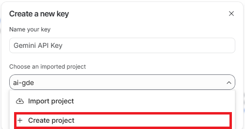
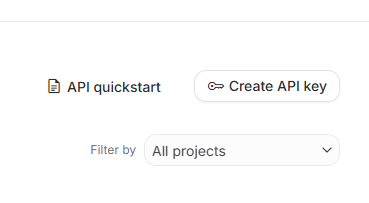
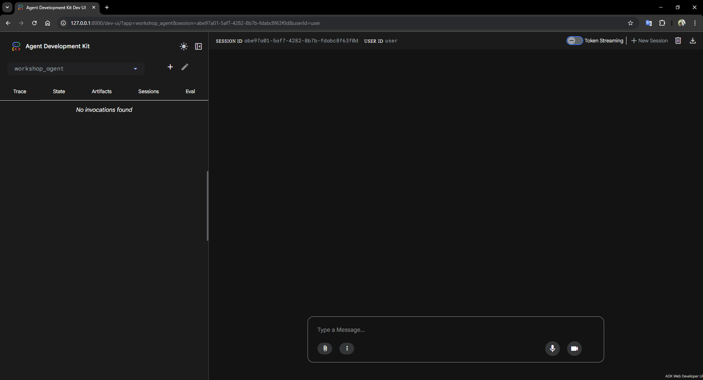

# ADK Hands-on Workshop

여행과 모임을 주제로 ADK 에이전트의 기초부터 검색, 메모리, 협업 구조까지 단계별로 실습합니다.

## 실습 가이드

각 Lab은 독립적인 패키지로 구성되어 있습니다. 순서대로 진행하며 에이전트의 주요 기능을 단계별로 익힐 수 있습니다.

- [Lab 1. 메모 비서 에이전트](lab1/README.md): 모델, 지침, 도구를 연결하는 기초 과정을 다룹니다.
- [Lab 2. 여행 검색과 메모리](lab2/README.md): 웹 검색 기능과 장기 기억 활용법을 실습합니다.
- [Lab 3. 모임 관리 에이전트](lab3/README.md): 여러 에이전트의 협업 구조와 UI 연동 방법을 학습합니다.

## 사전 준비

### Google API Key 설정

모든 실습은 워크스페이스 루트의 `.env` 파일에 설정된 API 키를 사용합니다.

1. [Google AI Studio](https://aistudio.google.com/)에서 API 키를 발급받습니다. 발급을 위해 Google Cloud 프로젝트를 선택하거나 새로 만들어야 합니다.
   

   프로젝트 준비가 끝나면 API 키를 생성하고 복사해 둡니다.
   

2. 루트 디렉토리의 `.env.template` 파일을 `.env`로 복사합니다.
   ```bash
   cp .env.template .env
   ```
3. `.env` 파일을 열고 `GOOGLE_API_KEY` 항목에 발급받은 키를 입력합니다. 설정이 완료된 `.env` 파일의 모습은 다음과 같습니다.
   ```env
   GOOGLE_API_KEY=AIzaSy... (본인의 API 키 입력)
   ```

### 공통 개발 환경

각 실습 폴더의 `handson` 디렉토리에서 가상환경을 활성화하고 필수 패키지를 설치합니다.

```bash
cd lab1/handson
python -m venv .venv
source .venv/bin/activate
python -m pip install --upgrade pip
python -m pip install -e .
```

실행 시 터미널 프롬프트 앞에 `(.venv)`가 표시되는지 확인합니다. 상세한 실행 방법은 각 Lab의 README 문서에 안내되어 있습니다.

## ADK 에이전트의 이해

ADK 에이전트는 언어 모델이 주어진 역할을 수행하기 위해 도구를 사용하고 판단하는 실행 주체입니다. 사용자 요청에 따라 정보를 검색하거나 파일을 저장하는 등 실질적인 업무를 수행합니다.

### 주요 구성 요소

에이전트는 다음 요소들을 조합하여 구성합니다.

- **모델**: 에이전트의 판단과 추론을 담당하는 언어 모델입니다. 이번 실습에서는 Gemini 3.1 계열 모델을 사용합니다.
- **지침**: 에이전트가 수행할 역할과 지침입니다.
- **도구**: 에이전트가 외부 정보를 가져오거나 작업을 수행할 때 사용하는 기능입니다.
- **메모리**: 대화 맥력 유지 및 과거 정보 활용을 위한 저장소입니다.
- **그래프**: 전체적인 실행 흐름과 단계별 연결 구조를 정의합니다.

에이전트의 동작 과정은 ADK 웹 콘솔에서 상세히 확인할 수 있습니다.


상세한 아키텍처와 활용법은 [ADK 공식 문서](https://adk.dev/)에서 확인할 수 있습니다.
- [Core Concepts](https://adk.dev/get-started/about/)
- [Python Quickstart](https://adk.dev/get-started/python/)
- [Memory & Sessions](https://adk.dev/sessions/memory/)
