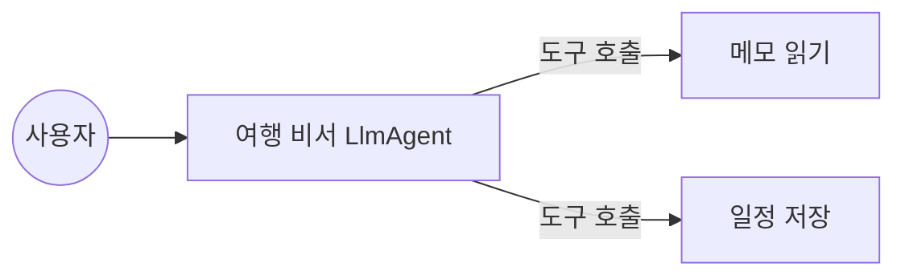
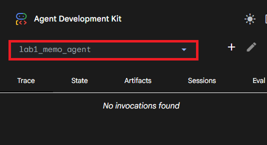
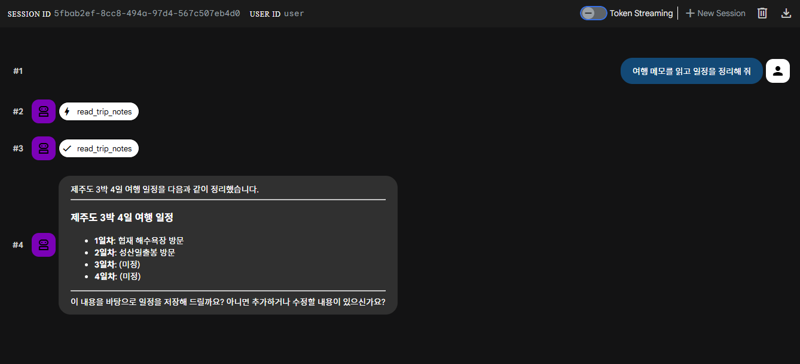
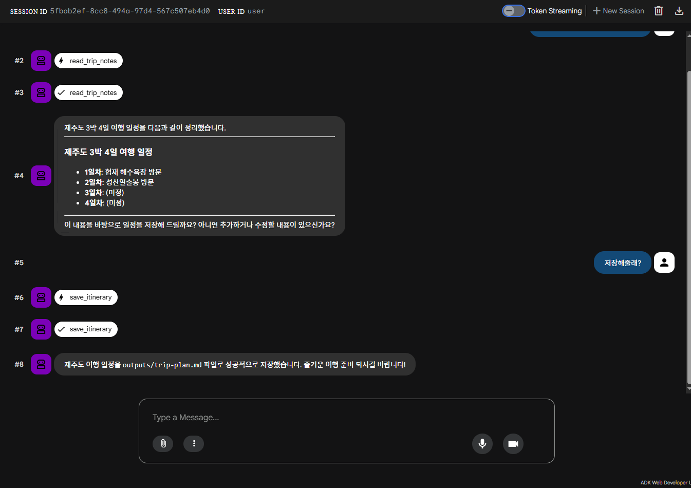
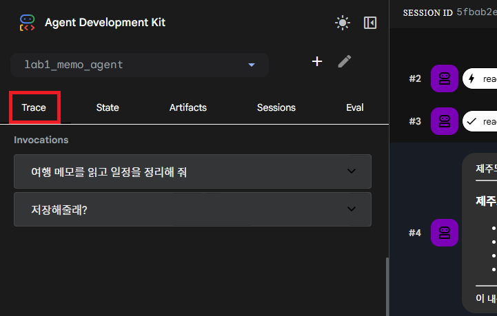
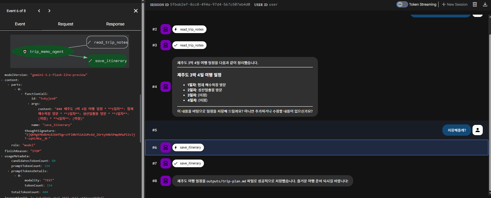

# Lab 1: 메모 비서 에이전트

> [!NOTE]
> 실습 진행에 필요한 발표 자료와 가이드를 확인해 주세요.
> - 발표 자료: [Google Slides](https://docs.google.com/presentation/d/1LSxyGVS2fpUWVQ_QHji3HeSw9zw5Ms2Lwcr9jQNfS3U/edit?usp=sharing)
> - 핸즈온 대처 가이드: [Google Docs](https://docs.google.com/document/d/1x8hEyDTr-tvmfCzUtUYkC7z_KOJFxbxD/edit?usp=sharing&ouid=114268949095976081208&rtpof=true&sd=true) (진행 중 오류가 발생할 경우 참고하세요.)

이번 실습에서는 사용자가 작성한 여행 메모를 읽고, 내용을 정리해 파일로 저장하는 에이전트를 함께 만들어 보겠습니다.

## 실습 목표

에이전트를 구성하는 모델(Model), 지침(Instruction), 도구(Tool)가 각각 어떤 역할을 하는지 알아봅니다. 사용자의 요청에 따라 메모를 읽어오는 `read_trip_notes`와 결과물을 저장하는 `save_itinerary` 도구를 사용하는 에이전트를 직접 구성해 보는 것이 목표입니다.



> [!NOTE]
> 에이전트 그래프: 요청이 처리되는 전체 구조를 뜻합니다. 사용자가 메시지를 보내면 LlmAgent가 상황을 판단하고, 실제 작업은 도구인 `read_trip_notes`와 `save_itinerary`에 맡기는 방식입니다.

에이전트는 모델이 모든 답을 직접 생성하는 대신, 상황에 맞는 도구를 선택해서 활용합니다. 파일 처리 작업은 Python 함수가 담당하고, 모델은 그 결과를 확인하며 다음 행동을 결정합니다.

## 1. 패키지 및 환경 설정

실습 폴더인 `lab1/handson`으로 이동해서 가상환경부터 준비해 봅시다.

```bash
cd lab1/handson
python -m venv .venv
source .venv/bin/activate
python -m pip install --upgrade pip
python -m pip install -e .
```

가상환경 활성화 후에는 워크스페이스 루트의 `.env` 파일에 API 키가 설정되어 있는지 확인합니다. 설정이 완료된 `.env` 파일의 모습은 아래와 같습니다.

```env
GOOGLE_API_KEY=AIzaSy... (본인의 API 키 입력)
```

## 2. 현재 상태 점검

본격적으로 코드를 수정하기 전에, 에이전트가 지금은 어떻게 동작하는지 먼저 확인해 보겠습니다.

```bash
adk run agents/lab1_memo_agent
```

> [!TIP]
> 이는 ADK의 일부 기능이 실험 단계임을 알리는 경고입니다. 실습을 진행하는 데는 아무런 지장이 없으니 안심하고 넘어가셔도 됩니다.
> `Running agent lab1_memo_agent...` 메시지가 출력되고 대화가 시작된다면 정상적으로 실행된 것입니다.

대화 프롬프트에 `"여행 메모를 읽고 일정을 정리해 줘"`라고 입력해 볼까요? 현재는 지침이 비어 있어 메모 파일을 읽거나 결과를 저장하지 못하는 모습을 확인할 수 있습니다.

```text
adk run agents/lab1_memo_agent

[user]: 여행 메모를 읽고 일정을 정리해 줘
[lab1_memo_agent]: 네, 여행 메모를 바탕으로 일정을 정리해 드릴게요.

여행 메모를 여기에 붙여넣어 주시면 제가 읽고 깔끔하게 정리해 드리겠습니다! 어떤 형식으로 정리해 드릴까요? (예: 날짜별, 방문지별, 활동별 등)
[user]: exit
```

대화를 나가고 싶다면 위 예시처럼 메시지로 `exit`를 입력하고 엔터를 누르면 됩니다.

## 3. 에이전트 구현하기

이제 `agents/lab1_memo_agent/agent.py` 파일에 에이전트 설정을 직접 채워 볼 차례입니다. `LlmAgent`를 생성하고 모델, 지침, 도구를 연결해 보겠습니다. 에이전트는 사용자의 의도를 파악해 등록된 도구 중 필요한 기능을 스스로 선택해서 실행하게 됩니다.

> **LlmAgent**: 언어 모델을 중심으로 구동되는 에이전트입니다. 에이전트 이름, 엔진, 지침, 도구 목록을 정의하여 생성합니다.

에이전트의 동작은 계획(Planning), 기억(Memory), 도구(Tools)의 세 가지 요소로 구성됩니다.

| 구성 요소 | 기술적 정의 | 주요 역할 |
| :--- | :--- | :--- |
| **계획 (Planning)** | `Instruction` | 작업 순서와 규칙을 정의하고 모델의 추론 방향을 설정합니다. |
| **기억 (Memory)** | `Session`, `Memory` | 현재 대화의 상태를 유지하거나 과거 기록을 검색하여 답변에 반영합니다. |
| **도구 (Tools)** | `Function Call` | LlmAgent가 직접 수행할 수 없는 외부 작업을 처리합니다. |


에이전트가 도구를 정확하게 이해하도록 함수의 이름, 타입 힌트, 그리고 설명을 작성해 주세요. ADK는 이 정보를 읽어서 모델이 이해할 수 있는 형태로 자동 변환합니다. 실습에 사용할 도구는 `tools.py`에 준비되어 있습니다. `read_trip_notes`는 메모 파일을 읽어오고, `save_itinerary`는 정리된 내용을 파일로 저장하는 기능을 합니다.

`agent.py`의 `build_travel_agent()` 함수를 아래와 같이 구성해봅시다.

```python
def build_travel_agent() -> LlmAgent:
    return LlmAgent(
        name="lab1_memo_agent",
        model="gemini-3-flash-preview",
        instruction=(
            "여행 메모를 읽고 일정을 정리해 저장하는 비서입니다. "
            "먼저 read_trip_notes 도구로 메모 내용을 확인하고, "
            "내용을 정리해 save_itinerary 도구로 저장하세요."
        ),
        tools=[
            read_trip_notes,
            save_itinerary,
        ],
    )
```

Instruction에 작업 순서를 명확하게 적어주면 에이전트가 도구를 더욱 정확하게 사용합니다.

## 4. 제대로 동작하는지 확인하기

수정한 코드가 의도대로 동작하는지 다시 한번 확인해 보겠습니다.

```bash
adk run agents/lab1_memo_agent
```

이전과 똑같이 요청을 보내 볼까요? 메모를 읽고 파일을 저장하는 흐름이 자연스럽게 진행된다면 성공입니다!

```text
adk run agents/lab1_memo_agent

[user]: 여행 메모를 읽고 일정을 정리해 줘
[lab1_memo_agent]: 제주도 3박 4일 여행 일정을 다음과 같이 정리했습니다.

---

### **제주도 3박 4일 여행 일정**

*   **1일차:** 협재 해수욕장 방문
*   **2일차:** 성산일출봉 방문
*   **3일차:** (추가 예정)
*   **4일차:** (추가 예정)
---

이 내용을 파일로 저장할까요? 혹시 3일차와 4일차에 추가하고 싶은 내용이 있다면 알려주세요!
[user]: 저장해줄래?
[lab1_memo_agent]: 일정을 성공적으로 저장했습니다! (`outputs/trip-plan.md`)

나중에 3일차와 4일차 계획이 생기면 언제든 말씀해 주세요. 내용을 수정해서 다시 저장해 드릴게요.
[lab1_memo_agent]: exit
```

모든 작업이 문제 없이 완료되었다면, `outputs` 폴더 안에 `trip-plan.md` 파일이 정상적으로 저장된 것을 확인할 수 있습니다.

```bash
cat outputs/trip-plan.md
```

### ADK 웹 콘솔 활용 가이드

터미널 기반의 CLI뿐만 아니라, ADK 웹 콘솔을 이용하면 에이전트의 내부 동작과 도구 호출 흐름을 시각적으로 확인할 수 있습니다.

#### Step 1: 웹 콘솔 서버 실행
터미널에서 아래 명령어를 실행하여 웹 서버를 가동합니다. 에이전트가 포함된 디렉토리를 지정해야 합니다.
```bash
adk web agents/ --host 0.0.0.0 --allow_origins="*"
```

`adk web` 명령어를 통해 에이전트를 브라우저를 통해 UI로 직관적으로 살펴보며 확인할 수 있습니다. adk web을 사용하면 다음과 같은 이점을 얻을 수 있습니다.

- 다양한 형태의 에이전트 아키텍처 흐름을 그래프 형태로 시각적으로 제공합니다. 
- 추적(Trace) 기능을 통해 에이전트의 내부 동작을 단계별로 확인할 수 있습니다. 이를 이용해 디버깅이 용이합니다.

또한 `adk web`에 옵션을 붙여 사용했는데, 그 의미는 다음과 같습니다.

| 옵션 | 역할 | 설정 이유 |
| :--- | :--- | :--- |
| --host 0.0.0.0 | 서버가 모든 네트워크 인터페이스의 요청을 수신하도록 설정 | Cloud Shell 프록시를 통한 외부 접속을 허용합니다. |
| --allow_origins="*" | 브라우저의 교차 출처 리소스 공유 제한 해제 | Cloud Shell 웹 미리보기와 서버 주소 불일치로 인한 통신 차단을 문제를 예방합니다. |

> 주의 사항: `adk web`은 보통 `8000` 포트로 실행됩니다.
 만약 다른 프로그램이 이미 `8000` 포트를 사용 중이라면, `adk web agents/ --host 0.0.0.0 --allow_origins="*" --port 8080`과 같이 다른 포트를 지정해야 합니다. 웹 브라우저에서 `http://127.0.0.1:8000` 주소를 클릭하거나 브라우저에 직접 입력하여 접속합니다. 

#### Step 2: 브라우저 접속 및 에이전트 선택
1. 앞서 실행한 터미널에 표시된 `http://127.0.0.1:8000` 주소를 클릭하거나 브라우저에 직접 입력하여 접속합니다.
2. 좌측 상단 메뉴에서 `lab1_memo_agent`를 선택합니다. (다음 이미지를 참고하세요.)
   - 웹 콘솔의 목록에는 에이전트 폴더명인 `lab1_memo_agent`가 표시됩니다.
   - 대화 말풍선과 CLI 로그에는 코드에서 지정한 에이전트 이름인 `lab1_memo_agent`가 표시됩니다.



#### Step 3: 대화 및 도구 호출 확인
브라우저에 보이는 메시지 입력창에 아래 메시지를 입력하고 에이전트의 결과를 살펴보세요.

```text
여행 메모를 읽고 일정을 정리해 줘
```

에이전트 구성이 정상적이라면 다음과 같은 결과를 볼 수 있습니다.



저장할지 여부를 에이전트가 묻는다면 `"저장해줄래?"` 정도의 짧은 응답을 입력해 주세요. 이와 같이 에이전트는 대화 내용을 바탕으로 추가적인 행동을 수행할 수 있습니다. 전체 과정이 정상적으로 진행된다면, 아래와 같은 결과를 확인할 수 있습니다.



이제 `save_itinerary` 도구가 호출된 것도 확인이 가능합니다!

좌측의 **Trace** 탭을 확인하면 에이전트가 각 메시지에 대한 계획을 어떻게 세우고, 어떤 도구를 호출했는지 한눈에 파악할 수 있습니다.



이번엔 대화 메시지 중 `save_itinerary` 말풍선 좌측에 로봇 아이콘을 눌러볼까요?



로봇 아이콘을 누르면, 그 에이전트의 대화가 진행된 시점의 이벤트를 진달할 수 있는 화면이 나옵니다. 이 기능을 잘 활용하면 모델의 도구 호출 시점과 결과를 한눈에 파악하기 좋습니다.

축하합니다! 첫 번째 실습을 마쳤습니다. 에이전트와 도구를 연결하는 기초를 다졌으니, 다음 실습에서는 실시간 검색과 기억 기능을 추가해 보겠습니다.

👉 [Lab 2. 여행 검색과 메모리](../lab2/README.md)
