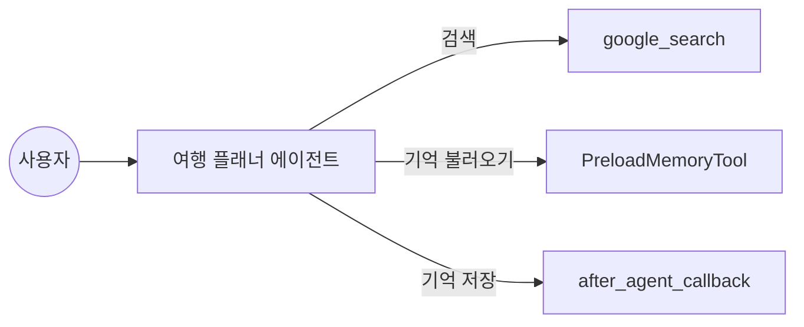
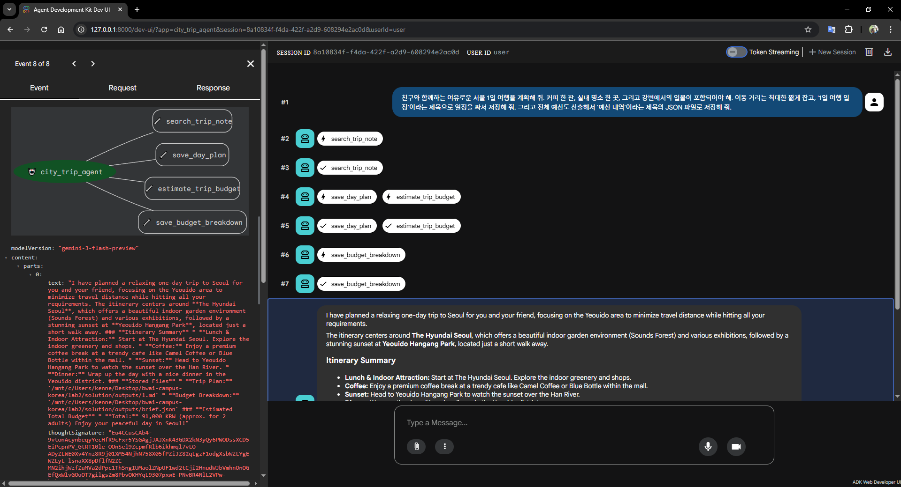

# Lab 2: 여행 검색과 메모리

Lab 2에서는 에이전트가 실시간 정보를 검색하고, 이전 대화 내용을 기억해 답변에 반영하는 방법을 배워 보겠습니다.

## 실습 목표

최신 여행 정보를 검색하는 `google_search` 도구와 대화 내용을 저장하고 불러오는 메모리 서비스의 활용법을 익힙니다. 답변이 끝난 뒤 자동으로 실행되는 `after_agent_callback`의 역할도 함께 살펴봅니다. 다음 다이어그램을 한번 살펴볼까요?



이번 실습에서 만드는 에이전트는 최신 정보가 필요하면 검색을 하고, 이전 대화 내용이 필요하면 저장된 기억을 불러옵니다. 답변을 마친 뒤에는 현재 대화 내용을 자동으로 저장하는 기능을 맡습니다.

> **세션과 메모리**: 세션은 현재 진행 중인 대화의 실시간 기록이며, 메모리 서비스는 이 기록을 나중에 다시 찾아볼 수 있게 보관하는 저장소입니다. 이번 실습에서는 휘발성 메모리와 파일 기반 저장소를 차례로 사용하며 데이터 보존의 차이를 확인합니다.

## 1. 패키지 및 환경 설정

`lab2/handson` 폴더로 이동해서 가상환경을 준비합니다.

```bash
cd lab2/handson
python -m venv .venv
source .venv/bin/activate
python -m pip install --upgrade pip
python -m pip install -e .
```

가상환경 활성화 후 워크스페이스 루트의 `.env` 파일에 API 키가 설정되어 있는지 확인합니다. 설정이 완료된 `.env` 파일의 모습은 아래와 같습니다.

```env
GOOGLE_API_KEY=AIzaSy... (본인의 API 키 입력)
```

## 2. 현재 상태 점검

본격적으로 코드를 수정하기 전에, 도구와 콜백이 아직 연결되지 않은 초기 상태를 먼저 확인해 보겠습니다.

```bash
adk run agents/lab2_trip_agent --session_service_uri="memory://" --memory_service_uri="memory://"
```

> [!NOTE]
> **세션 서비스와 메모리 서비스가 무엇인지 알아볼까요?**
> ADK에는 대화 기록을 관리하기 위한 두 가지 서비스가 있습니다. 데이터를 보관하는 목적과 기간에 따라 구분해서 사용합니다.
> - **session_service_uri**: 현재 진행 중인 대화의 상태를 실시간으로 관리합니다. 주로 `memory://` 방식을 사용합니다.
> - **memory_service_uri**: 과거 대화 기록을 보관하는 장기 저장소입니다. 나중에 다시 찾아볼 수 있도록 파일(`sqlite:./`)이나 데이터베이스에 영구적으로 저장할 때 사용합니다.

프롬프트에 `"오늘 부산 날씨 알려줘"`라고 한번 물어보세요. 아직 검색 도구가 연결되지 않았기 때문에 실시간 정보를 가져오지 못하고, 모델이 알고 있는 기본 지식에만 의존해서 답변할 것입니다.

```text
adk run agents/lab2_trip_agent --session_service_uri="memory://"

[user]: 오늘 부산 날씨 알려줘
[trip_planner]: 안녕하세요! 여러분의 여행을 도와드리는 **트립 플래너**입니다. 🧳

아쉽게도 저는 실시간 기상청 데이터에 직접 연결되어 있지 않아, 오늘 부산의 정확한 날씨(기온, 강수 확률 등)를 실시간으로 확인해 드리기는 어렵습니다. 정확한 날씨는 이용하시는 스마트폰의 날씨 앱이나 포털 사이트에서 부산 날씨를 검색해 보시는 것을 추천해 드립니다!

대신, 여행 플래너로서 **오늘 확인하신 날씨에 맞춰 어떤 부산 여행을 하면 좋을지** 맞춤형 코스를 추천해 드릴게요.

☀️ **만약 오늘 부산 날씨가 화창하게 맑다면?**
* **해운대 블루라인파크**: 눈부신 해안 절경을 따라 달리는 해변열차나 스카이캡슐 타기
* **흰여울문화마을**: 반짝이는 영도 바다를 배경으로 예쁜 골목길에서 인생샷 남기기
* **광안리 해변 & 요트 투어**: 탁 트인 바다와 함께 광안대교 뷰를 제대로 감상하기

☔ **만약 오늘 부산에 비가 오거나 꽤 흐리다면?**
* **센텀시티 스파랜드 & 신세계백화점**: 비를 피해 쾌적한 실내에서 즐기는 쇼핑과 럭셔리한 찜질
* **해운대 씨라이프 아쿠아리움**: 날씨에 구애받지 않는 신비로운 실내 바닷속 탐험
* **기장/영도 대형 오션뷰 카페**: 창밖으로 내리는 비와 파도를 감상하며 따뜻한 커피와 디저트 즐기기

오늘 날씨를 확인해 보시고, 누구와 함께 어떤 스타일의 여행을 하고 싶으신지 알려주세요. 그에 맞는 부산 여행 코스와 맛집을 계획해 드리겠습니다. 😊🌊
[user]: exit
```

보시는 것처럼 현재 에이전트는 실시간 검색이나 대화 기억 기능이 없습니다. 이제 `google_search`와 메모리 기능을 연결해 스마트한 여행 플래너를 완성해 봅시다.

## 3. 검색과 메모리 연결

이번 단계에서는 에이전트에 검색과 메모리 기능을 추가합니다. ADK는 비즈니스 로직 구현에 집중할 수 있도록 자주 쓰이는 도구들을 내장하고 있습니다.

### ADK 도구 생태계
`from google.adk.tools import google_search`와 같은 구문을 사용하여 검색 기능을 바로 사용할 수 있습니다. 검색 외에도 파일 관리, 캘린더 연동 등 다양한 도구가 준비되어 있으며, 전체 목록은 [ADK Integrations](https://adk.dev/integrations/)에서 확인 가능합니다.


기능 추가는 두 단계로 진행됩니다. 먼저 답변 직후에 대화를 저장하는 콜백 함수를 정의하고, 에이전트 설정에서 도구와 콜백을 연결합니다.

에이전트 답변이 끝난 뒤 실행할 후처리 로직을 직접 구현해 볼 차례입니다. `agents/lab2_trip_agent/tools.py` 파일을 열어 볼까요?

에이전트 답변이 완료된 직후 실행해야 할 후처리 로직은 `after_agent_callback`을 사용하여 구현합니다. 이 콜백은 응답 생성이 끝난 뒤 해당 턴이 종료되기 직전에 호출됩니다.

이번 실습에서는 사용자가 명시적으로 저장 명령을 내리지 않아도, 매 답변 직후에 현재 대화 내용(Session)을 메모리 서비스에 저장하도록 구현할 것입니다.

> [!NOTE]
> **콜백의 활용 사례**
> 대화 내용 저장 외에도 다음과 같은 후처리 작업에 자주 사용됩니다.
> - 답변 완료 후 사용자에게 만족도 설문 전송
> - 생성된 답변의 통계 데이터를 외부 서버에 기록
> - 답변 내용에 포함된 민감 정보 필터링 및 로깅

```python
async def auto_save_session_to_memory_callback(callback_context):
    # 메모리 서비스가 활성화되어 있는지 먼저 확인합니다.
    invocation_context = callback_context._invocation_context
    has_memory_attribute = hasattr(invocation_context, "memory_service")
    memory_service = invocation_context.memory_service if has_memory_attribute else None

    # 메모리 서비스가 준비된 경우에만 현재 대화를 저장소에 넣습니다.
    if memory_service:
        await memory_service.add_session_to_memory(invocation_context.session)
```

콜백 함수는 `callback_context`를 통해 에이전트의 실행 정보에 접근합니다. `invocation_context` 내부에는 현재 대화 기록인 `session`과 에이전트의 이름, 그리고 연결된 외부 서비스들이 담겨 있습니다.

여기서 `hasattr()`을 사용하는 이유는 실행 환경의 유연성 때문입니다. 사용자가 에이전트를 실행할 때 메모리 옵션(`--memory_service_uri`)을 주지 않았다면, `invocation_context`에 `memory_service`가 할당되지 않습니다. 이때 에이전트가 런타임 오류로 중단되지 않고 안전하게 다음 단계로 넘어갈 수 있도록 방어 코드를 작성한 것입니다.

작성한 콜백과 ADK 내장 도구들을 에이전트에 실제로 적용해 보시기 바랍니다. `agents/lab2_trip_agent/agent.py` 파일을 수정합니다.

에이전트가 최신 정보를 검색하고 과거 대화를 불러올 수 있도록 도구 목록에 `google_search`와 `PreloadMemoryTool`을 추가합니다. 또한, 앞서 `tools.py`에서 구현한 자동 저장 콜백을 에이전트에 연결합니다.

> [!NOTE]
> **내장 도구의 역할**
> - **google_search**: 웹 검색을 통해 실시간 정보를 가져옵니다.
> - **PreloadMemoryTool**: 매 질문 시작 시 메모리 저장소에서 현재 질문과 관련된 과거 기록을 검색하여 컨텍스트에 주입합니다. 이를 통해 에이전트가 이전 대화 맥락을 인지한 상태에서 답변할 수 있습니다.

여기서 주의할 점은 `include_server_side_tool_invocations=True` 설정입니다. 구글 검색과 같은 ADK 내장 도구들은 서버 측에서 실행되는 특수한 도구이므로, 이를 에이전트가 올바르게 호출하고 결과를 받아오기 위해서는 이 설정값이 반드시 필요합니다.

```python
return LlmAgent(
    name="trip_planner",
    model="gemini-3.1-pro-preview",
    instruction=(
        "실시간 웹 검색과 이전 대화 기억을 활용해 "
        "사용자 맞춤 여행 계획을 세우는 플래너입니다.\n"
        "이전 대화 내용이나 사용자의 취향을 기억에서 불러와 답변에 반영하세요."
    ),
    tools=[
        google_search,
        PreloadMemoryTool(),
    ],
    generate_content_config=types.GenerateContentConfig(
        tool_config=types.ToolConfig(include_server_side_tool_invocations=True),
    ),
    after_agent_callback=auto_save_session_to_memory_callback,
)
```

## 4. 제대로 동작하는지 확인하기

수정한 기능들이 의도대로 잘 동작하는지 확인해 보겠습니다. 이번에는 대화 기록을 보존할 수 있도록 저장소도 한번 확장해 볼까요?

### Step 1: 인메모리 테스트
먼저 메모리상에서만 데이터를 관리하여 기능이 작동하는지 확인합니다.
```bash
adk run agents/lab2_trip_agent --session_service_uri="memory://" --memory_service_uri="memory://"
```
프롬프트가 열리면 아래와 같이 대화를 나눠 보시기 바랍니다.
```text
Log setup complete: /tmp/agents_log/agent.20260428_200401.log
To access latest log: tail -F /tmp/agents_log/agent.latest.log
Running agent trip_planner, type exit to exit.

[user]: 이번 여행은 사람 적고 조용한 바닷가에서 쉬고 싶은데, 추천해 줄 만한 곳 있어?
[trip_planner]: 조용하고 여유롭게 파도 소리를 들으며 쉴 수 있는 바닷가를 찾으시는군요! 복잡한 인파를 피해 자연에 집중하며 힐링하기 좋은 국내의 한적한 해변들을 방향별로 추천해 드릴게요.

**1. [동해] 강원도 고성 '가진해변' & '마차진해변'**
*   **특징:** 고성은 강릉이나 속초에 비해 인적이 드물어 조용한 바다를 찾는 분들의 성지 같은 곳이에요. 특히 가진해변은 에메랄드빛 바다와 기암괴석이 어우러져 경치가 훌륭하고, 마차진해변은 최북단에 위치해 있어 오롯이 바다와 나만 있는 듯한 고요함을 느낄 수 있습니다.
*   **추천 포인트:** 투명하고 맑은 바다 보며 '물멍'하기, 해안 도로를 따라 드라이브하기.

**2. [서해] 충남 태안 '백리포 해수욕장'**
*   **특징:** 유명한 만리포 해수욕장 안쪽에 꽁꽁 숨겨져 있는 작고 프라이빗한 느낌의 해변입니다. 양옆이 숲으로 둘러싸여 있어 아늑하며, 시끄러운 상업 시설이 거의 없어 자연 속에서 오롯이 바다만 즐길 수 있습니다.
*   **추천 포인트:** 소나무 숲길 산책, 서해 특유의 아름답고 붉은 일몰 감상. 

**3. [남해] 경남 거제 '여차 몽돌 해변'**
*   **특징:** 모래 대신 둥글둥글한 몽돌(자갈)이 깔려 있는 작은 해변입니다. 사람들이 많이 찾는 구조라나 학동 해변에 비해 훨씬 조용하며, 파도가 몽돌에 부딪히며 내는 '차르르' 소리는 그 자체로 최고의 힐링 ASMR이 되어줍니다.
*   **추천 포인트:** 눈 감고 파도 소리 듣기, 해안도로(여차~홍포 구간) 절경 감상.

**4. [남해] 경남 남해 '설리 해수욕장'**
*   **특징:** '눈처럼 흰 모래'가 있는 아담하고 소담한 해변입니다. 규모가 작아 한적함을 유지하면서도 주변 풍경이 그림처럼 아름다워 소수만 아는 감성 힐링 명소로 꼽힙니다.
*   **추천 포인트:** 잔잔한 파도에 발 담그기, 조용하고 이국적인 남해의 분위기 만끽.

거주하시는 곳이나 선호하시는 이동 거리(동해, 서해, 남해)가 있으신가요? 혹은 '고운 모래사장'과 '파도 소리가 좋은 몽돌' 중 끌리는 곳이 있다면 말씀해 주세요. 취향에 맞춰 주변의 조용한 숙소나 맛집까지 함께 여행 코스로 계획해 드릴게요!
[user]: exit
```
프로그램을 종료한 뒤 다시 실행하여 이름을 물어보세요. 인메모리 방식을 사용했기 때문에 에이전트는 이전 대화 내용을 유지하지 못합니다.

### Step 2: 로컬 파일 기반 테스트
이번에는 파일로 세션 기록을 남겨 에이전트를 재시작한 후에도 대화가 유지되는지 확인해 봅시다. 동일한 `session_id`를 사용하면 에이전트가 이전 대화 내용을 자동으로 불러옵니다.

```bash
# 출력 폴더 생성
mkdir -p outputs

# SQLite를 사용하여 세션을 파일에 저장합니다.
adk run agents/lab2_trip_agent --session_service_uri="sqlite:./outputs/session.db" --session_id="my_trip_session"
```

> **왜 `aiosqlite`를 사용하나요?**
> ADK는 모든 처리가 비동기(`asyncio`)로 이루어집니다. 따라서 일반적인 `sqlite3` 라이브러리 대신 비동기 환경에 최적화된 `aiosqlite` 드라이버를 내부적으로 사용합니다. SQLAlchemy 등을 연결할 때도 `sqlite+aiosqlite:///`와 같은 형식을 사용합니다.

프롬프트가 열리면 본인의 이름과 취향을 알려준 뒤 종료(`exit`)해 보십시오. 그 다음 다시 동일한 명령어로 에이전트를 실행하여 이름을 기억하는지 확인합니다.

```text
# 첫 번째 실행 (취향 전달 및 종료)
Log setup complete: /tmp/agents_log/agent.20260428_200526.log
Running agent trip_planner, type exit to exit.

[user]: 이번 여행은 사람 적고 조용한 바닷가에서 쉬고 싶은데, 추천해 줄 만한 곳 있어?
[trip_planner]: 사람 북적이는 곳을 벗어나 조용히 파도 소리만 들으며 쉬고 싶으시군요! 강원도 고성의 '가진해변'을 추천해 드립니다.
[user]: exit

# 동일한 session_id로 재실행 (기억 확인)
adk run agents/lab2_trip_agent --session_service_uri="sqlite:./outputs/session.db" --session_id="my_trip_session"

Log setup complete: /tmp/agents_log/agent.20260428_200619.log
Running agent trip_planner, type exit to exit.

[user]: 아까 말한 조용한 바다 근처로 숙소도 같이 추천해줄래?
[trip_planner]: 네, 아까 추천해 드린 강원도 고성 가진해변 근처의 숙소를 말씀하시는군요! 가진해변 인근에는 바다 전망이 좋은 작은 펜션들이 많아 한적하게 머무르기 좋습니다.

*   **모닝하버 펜션 (봉포해변)**
    *   **특징:** 객실 전면이 통창으로 되어 있어, 방 안에서 푸른 동해 바다와 일출을 파노라마로 감상할 수 있는 오션뷰 숙소입니다. 번잡한 도심을 벗어나 파도 소리를 배경 삼아 쾌적하고 조용하게 머물기 좋습니다.
*   **페블비치 펜션 (아야진해변)**
    *   **특징:** 걸어서 30초면 바다에 닿을 수 있는 해변 앞 펜션입니다. 수심이 얕고 바위가 예쁜 아야진 해변을 한적하게 산책하기 좋으며, 개별 테라스에서 바닷바람을 맞으며 조용히 티타임을 갖기에 제격입니다.

---

혹시 아까 말씀하셨던 바다가 이 중에 있나요? 만약 다른 지역(예: 동해안, 서해안, 제주도 등)이었다면 편하게 **지역명이나 해수욕장 이름**을 알려주세요! 그곳의 숨겨진 조용하고 예쁜 숙소들을 다시 엄선해 추천해 드리겠습니다.
```

**결과**: 에이전트가 이전 대화에서 언급한 '조용한 바닷가'와 '가진해변'이라는 맥락을 정확히 기억해 답변한다면 성공입니다.

---

### ADK 메모리 저장소 옵션

ADK는 환경에 따라 다양한 저장소 방식을 지원합니다. 상황에 맞는 URI 형식을 선택하여 사용할 수 있습니다.

| URI 형식 | 저장 방식 | 특징 | 권장 용도 |
| :--- | :--- | :--- | :--- |
| `memory://` | 인메모리 (휘발성) | 프로그램 종료 시 데이터 삭제 | 간단한 기능 테스트, 디버깅 |
| `sqlite:./path/db` | 로컬 파일 (영구) | SQLite DB 파일에 기록 보존 | 로컬 개발, 소규모 프로젝트 |
| `redis://host:port` | 인메모리 DB (영구) | 빠른 속도와 확장성 제공 | 고성능 프로덕션 서비스 |
| `postgresql://...` | RDBMS (영구) | 안정적인 관계형 데이터 관리 | 기업용 애플리케이션 |

### ADK 웹 콘솔 활용 가이드

텍스트 로그만으로는 파악하기 힘든 에이전트의 내부 동작을 웹 콘솔에서 더 직관적으로 살펴볼 수 있습니다. 

#### Step 1: 웹 콘솔 서버 실행
터미널에서 아래 명령어를 실행합니다. 에이전트 경로와 세션 저장소 위치를 정확히 지정해야 웹에서도 이전 대화를 불러올 수 있습니다.
```bash
adk web agents/ --session_service_uri="sqlite:./outputs/session.db"
```

#### Step 2: 에이전트 선택 및 대화
1. 브라우저에서 `http://127.0.0.1:8000`에 접속합니다.
2. 좌측 상단 메뉴에서 `trip_planner`를 클릭합니다.
3. 하단 입력창에 아래와 같은 질문을 던져보세요.
   ```text
   아까 말한 조용한 바다 근처로 숙소도 같이 추천해줄래?
   ```

#### Step 3: 메모리(기억) 복원 확인
중앙의 **Trace** 탭을 클릭하여 에이전트가 과거의 대화 내용을 메모리에서 어떻게 꺼내 오는지 실시간으로 모니터링합니다.



두 번째 실습을 마쳤습니다. 다음 실습에서는 여러 에이전트를 연결하는 방법을 배워보겠습니다.

👉 [Lab 3. 모임 관리 에이전트](../lab3/README.md)
