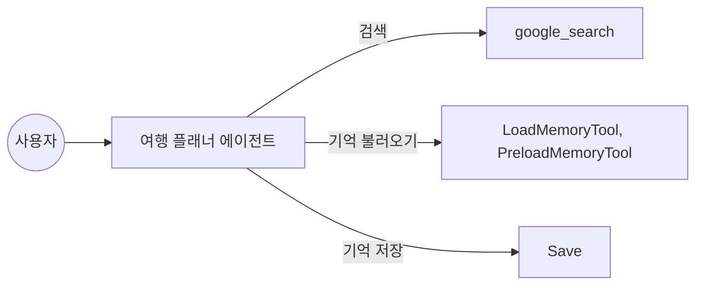
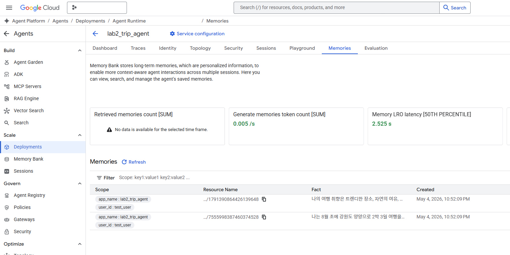

# Lab 2: 여행 검색과 메모리

Lab 2에서는 에이전트가 실시간 정보를 검색하고, 이전 대화 내용을 기억해 답변에 반영하는 방법을 배워 보겠습니다.

## 실습 목표

최신 여행 정보를 검색하는 `google_search` 도구와 대화 내용을 저장하고 불러오는 메모리 서비스의 활용법을 익힙니다.



이번 실습에서 만드는 에이전트는 최신 정보가 필요하면 검색을 하고, 이전 대화 내용이 필요하면 저장된 기억을 불러옵니다. 답변을 마친 뒤에는 현재 대화 내용을 자동으로 저장하는 기능을 콜백 함수를 이용해 구현해봅시다.

자 그러면 본격적으로 시작해볼까요?

## 1. 패키지 및 환경 설정

`lab2/handson` 폴더로 이동해서 가상환경을 준비합시다.

```bash
cd lab2/handson
python -m venv .venv
source .venv/bin/activate
python -m pip install --upgrade pip
python -m pip install -e .
```

가상환경 활성화 후 워크스페이스 루트의 `.env` 파일에 API 키가 설정되어 있는지 확인합니다. 설정이 완료된 `.env` 파일의 모습은 아래와 같습니다.

```env
GOOGLE_API_KEY=AIzaSy... (본인의 API 키 입력)
```

## 2. 현재 상태 점검

본격적으로 코드를 수정하기 전에, 도구와 콜백이 아직 연결되지 않은 초기 상태를 먼저 확인해 보겠습니다.

```bash
adk run agents/lab2_trip_agent \
  --session_service_uri="sqlite://./outputs/session.db" \
  --memory_service_uri="memory://"
```

명령어를 실행하면 에이전트가 대기 상태가 됩니다. 먼저 간단한 인사를 나눠 에이전트가 정상적으로 응답하는지 확인해 보세요.

```text
[user]: 안녕! 어떤 것들을 도와줄 수 있어?
[lab2_trip_agent]: 안녕하세요! 저는 여행 전문 어시스턴트 **lab2_trip_agent**입니다. 여러분의 완벽한 여행을 위해 다음과 같은 도움을 드릴 수 있어요.

1.  **여행지 추천**: 여러분의 취향(휴양, 액티비티, 미식, 문화 예술 등)과 예산, 일정에 딱 맞는 여행지를 추천해 드립니다.
2.  **맞춤형 일정 계획**: 가고 싶은 도시나 장소를 알려주시면, 동선을 고려한 상세한 일자별 스케줄을 짜 드립니다.
3.  **맛집 및 명소 정보**: 현지에서 꼭 먹어봐야 할 음식, 숨겨진 명소, 예약 방법 등 유용한 정보를 제공합니다.
4.  **여행 꿀팁**: 짐 싸기 체크리스트, 현지 날씨 정보, 교통편 이용 방법, 환율 및 매너 등 실질적인 도움을 드립니다.
5.  **예산 가이드**: 예상되는 숙박비, 식비, 교통비 등을 산출하여 여행 계획을 세우는 데 도움을 드립니다.

혹시 지금 계획 중이거나 가보고 싶은 여행지가 있으신가요? 궁금한 점이 있다면 무엇이든 물어봐 주세요!
[user]: exit
```

정상적인 응답을 확인했다면 `exit`를 입력해 종료합니다. 이제 방금 입력한 명령어에 포함된 옵션들이 각각 무엇을 의미하는지 알아보겠습니다.

앞서 살펴본 명령어에서 두가지 옵션을 사용했습니다. 각 옵션의 의미는 다음과 같습니다.

| 옵션                    | 값                              | 의미                                      |
| :---------------------- | :------------------------------ | :---------------------------------------- |
| `--session_service_uri` | `sqlite://./outputs/session.db` | 세션 실행 기록을 SQLite 파일에 저장       |
| `--memory_service_uri`  | `memory://`                     | 기억 저장소는 로컬 인메모리 방식으로 사용 |

세션 서비스와 메모리 서비스가 분리되어 있는 사실을 알 수 있습니다. 이 두 개념은 데이터의 관리 범위와 목적이 달라 따로 관리할 수 있도록 설계되었습니다. 세션 관리는 여러 사용자의 대화 기록을 개별적으로 구분하여 관리해야 하는 서비스 환경에서 유용하게 활용됩니다. 

세션 서비스는 대화 도중에 발생하는 이벤트와 상태 정보를 순차적으로 기록하며 대화의 흐름을 유지합니다. 하지만 이 기록만으로는 대화 내용 중 필요한 정보를 선별하여 찾아내는 기능을 수행하기 어렵습니다. 반면 메모리 서비스는 대화 내용에서 주요 정보를 추출하여 검색에 최적화된 형태로 저장합니다. 에이전트가 과거 정보를 답변에 활용하려면 이처럼 인덱싱된 데이터를 제공하는 메모리 서비스가 필요합니다.

- **session_service_uri**: 대화의 상태를 관리합니다. sqlite를 지정하면 재실행 시 이전 대화의 흐름을 불러올 수 있습니다.
- **memory_service_uri**: 지식을 검색할 저장소를 지정합니다. 로컬 테스트용 memory 방식은 휘발성이므로 프로세스 종료 시 정보가 사라집니다. 영구적인 보관을 위해서는 별도의 메모리 서비스 연결이 필요합니다.

실제 서비스 환경에서는 두 저장 개념이 모두 중요하지만, 이번 실습에서는 세션 저장소보다는 대화 내용을 추출하여 장기 보관하고, 나중에 다시 찾아보는 메모리 서비스 기능에 더 집중하여 진행하겠습니다.

앞서 살펴본 개념들을 바탕으로, 이제 에이전트의 인메모리(`memory://`) 동작 방식을 직접 확인해 보겠습니다. 다시 한번 에이전트를 실행하여 여러분이 관심있는 여행에 대해서 말해보세요!.

```bash
adk run agents/lab2_trip_agent \
  --session_service_uri="sqlite://./outputs/session.db" \
  --memory_service_uri="memory://"
```

> [!CAUTION]
> 현재 버전에서는 `--memory_service_uri="sqlite://./outputs/memory.db"`와 같이 SQLite 파일은 `memory_service_uri`에서 지원하지 않습니다. SQLite 파일은 `session_service_uri`의 세션 저장소로는 사용할 수 있지만, `memory_service_uri`에서 사용하면 에러가 발생합니다.

바닷가 인근 여행지를 알아볼까요?

```text
[user]: 이번 여행은 사람 적고 조용한 바닷가에서 쉬고 싶은데, 추천해 줄 만한 곳 있어?
```

잠시 뒤 다음과 같이 답변이 오면 `exit`를 눌러 대화를 종료하세요.

```text
[lab2_trip_agent]: 조용하고 한적한 바닷가에서 진정한 '쉼'을 원하시는군요. 유명 관광지의 북적임에서 벗어나 파도 소리에 집중하며 휴식하기 좋은 국내 여행지 4곳을 추천해 드릴게요.

### 1. 강원도 고성 (아야진, 백도 해변)
강릉이나 속초보다 훨씬 위쪽에 위치해 있어 상대적으로 사람의 발길이 적습니다.
(...중략...)

3. 여행 **기간**은 어느 정도 생각하고 계신가요?

말씀해 주시면 귀하의 취향에 딱 맞는 장소와 숙소까지 상세히 안내해 드릴게요!
[user]: exit
```

지금 위 대화 과정은 다음과 같은 절차대로 처리됩니다.

```text
사용자 대화
  ↓
Session Service
  - 현재 세션의 이벤트와 상태 저장
  - 여기서는 sqlite://./outputs/session.db 사용
  ↓
대화 저장

Memory Service
  - 세션 내용을 검색 가능한 기억으로 추가
  - 여기서는 memory:// 사용
  - 프로세스 종료 시 사라짐

다음 사용자 질문
  ↓
PreloadMemoryTool 또는 LoadMemoryTool (LoadMemory는 선택적으로 활용됩니다.)
  ↓
Memory Service에서 관련 기억 검색
  ↓
에이전트 답변에 반영
```

그러면 우리가 원하는 장기 기억은 어떻게 처리할까요? 다음 단계를 통해 천천히 알아봅시다.

## 3. 검색과 메모리 연결

이번 단계에서는 에이전트에 검색과 장기 메모리 기능을 추가할 것입니다. ADK는 에이전트 구현에 집중할 수 있도록 자주 쓰이는 도구들을 내장하고 있습니다. 이외에도 다양한 도구들을 [ADK Integrations](https://adk.dev/integrations/)에서 확인할 수 있습니다.


자, 먼저 `agents/lab2_trip_agent/agent.py`를 열어 에이전트 정의 부분을 확인해 봅시다. 대화 내용을 메모리 서비스에 저장하려면 대화 종료 시점에 세션 정보를 전송하는 콜백 함수가 필요합니다.

```python
from google.adk.agents.callback_context import CallbackContext

# 대화가 종료된 후 세션 데이터를 메모리 뱅크로 추출 및 저장하는 콜백 함수입니다.
async def auto_save_session_to_memory_callback(callback_context: CallbackContext):
    # ... (중략) ...

def build_trip_planner() -> LlmAgent:
    return LlmAgent(
        name="lab2_trip_agent",
        model="gemini-3-flash-preview",
        instruction=(
            "당신은 실시간 웹 검색과 이전 대화 기억을 활용하여 "
            "사용자 맞춤형 여행 계획을 수립하는 수석 플래너입니다.\n"
            "이전 대화 맥락이나 사용자의 취향을 기억에서 불러와 답변에 반영하세요."
        ),
        tools=[
            google_search,
            # TODO: 메모리 관련 도구들을 주석 처리해제하여 활성화 해보세요!
            # LoadMemoryTool은 에이전트가 메모리에서 정보를 검색할 때 사용할 수 있는 도구입니다.
            # 명시적인 호출이 없는 한 이 도구는 사용되지 않습니다.
            # LoadMemoryTool(),
            # PreloadMemoryTool은 시작과 매번 대화 과정에 자동으로 실행하여 메모리에서 정보를 불러옵니다.
            # PreloadMemoryTool(),
        ],
        after_agent_callback=auto_save_session_to_memory_callback,
        generate_content_config=types.GenerateContentConfig(
            tool_config=types.ToolConfig(include_server_side_tool_invocations=True),
        ),
    )
```

이 코드에서 `after_agent_callback`은 에이전트가 대화 한 턴을 마칠 때마다 실행되는 후처리 로직을 정의합니다. `auto_save_session_to_memory_callback` 콜백은 세션 서비스에 기록된 대화 데이터를 메모리 서비스로 전송하여 추출 및 인덱싱 과정을 트리거합니다. 이 단계가 생략되면 대화 내용은 단순 로그로만 남게 되며, 에이전트가 나중에 다시 찾아볼 수 있는 지식으로 변환되지 않습니다.

이번 Lab2에서는 위 코드의 TODO를 해결하면 됩니다. 몇가지 새로운 개념이 있죠? `generate_content_config` 속성이 눈에 띄는데 이곳에 `include_server_side_tool_invocations`이 활성화 되어있습니다. 이는 LLM이 외부 서버의 도구를 호출하고 그 결과를 받아와 에이전트에게 제공하는 역할을 합니다. 현재 예제에서는 `google_search`와 같은 도구들이 이러한 방식으로 동작하기 때문에 켜주시는게 좋습니다.

ADK의 메모리 서비스는 주로 다음과 같습니다.

| 항목               | `InMemoryMemoryService`                                    | `VertexAiMemoryBankService`                                                 | `VertexAiRagMemoryService`                                                 |
| :----------------- | :--------------------------------------------------------- | :-------------------------------------------------------------------------- | :------------------------------------------------------------------------- |
| 지속성             | 없음. 재시작하면 데이터가 사라짐                           | 있음. LlmAgent Platform에서 관리                                               | 있음. Knowledge Engine에 저장                                              |
| 주요 사용 사례     | 프로토타이핑, 로컬 개발, 간단한 테스트                     | 사용자 대화에서 의미 있는 기억을 만들고 지속적으로 발전시키는 에이전트 구축 | 전체 대화 코퍼스에 대한 벡터 검색 또는 다른 RAG 인덱싱 콘텐츠와 함께 검색  |
| 메모리 추출 방식   | 전체 대화 저장                                             | 대화에서 의미 있는 정보를 추출하고 기존 기억과 통합. LLM 기반               | 전체 대화를 저장하고 Knowledge Engine으로 인덱싱                           |
| 검색 기능          | 기본 키워드 매칭                                           | 고급 의미 기반 검색                                                         | Knowledge Engine 기반 벡터 유사도 검색                                     |
| 설정 복잡도        | 없음. 기본값                                               | 낮음. LlmAgent Platform의 LlmAgent Runtime 인스턴스 필요                          | 중간. Knowledge Engine 필요                                                |
| 의존성             | 없음                                                       | Google Cloud Project, LlmAgent Platform API                                    | Google Cloud Project, Knowledge Engine, LlmAgent Platform SDK. 선택 설치 가능 |
| 사용하기 좋은 경우 | 여러 세션의 채팅 기록을 로컬에서 간단히 검색해보고 싶을 때 | 에이전트가 과거 상호작용을 기억하고 학습하듯 반영하게 만들고 싶을 때        | 이미 RAG 인프라가 있거나 원본 대화 기록 전체를 대상으로 검색하고 싶을 때   |

즉슨 `--memory_service_uri="memory://"` 옵션으로 실행하면 프로세스 안의 휘발성 메모리에 저장되고, 이후에 다룰 `--memory_service_uri="agentengine://..."` 등의 외부 메모리 서비스를 지정하면 외부 메모리 뱅크에 저장됩니다. [더 자세한 문서](https://adk.dev/sessions/memory/)를 살펴보세요.

```python
return LlmAgent(
    name="lab2_trip_agent",
    model="gemini-3-flash-preview",
    instruction=(
        "실시간 웹 검색과 이전 대화 기억을 활용해 "
        "사용자 맞춤 여행 계획을 세우는 플래너입니다.\n"
        "이전 대화 내용이나 사용자의 취향을 기억에서 불러와 답변에 반영하세요."
    ),
    tools=[
        google_search,
        # 아래 도구들의 주석을 반드시 제거하세요.
        LoadMemoryTool(),
        PreloadMemoryTool(),
    ],
    # 대화 내용을 메모리 뱅크에 저장하도록 콜백을 설정합니다.
    after_agent_callback=auto_save_session_to_memory_callback,
    generate_content_config=types.GenerateContentConfig(
        tool_config=types.ToolConfig(include_server_side_tool_invocations=True),
    ),
)
```

메모리 서비스를 연결하지 않거나 인메모리 상태로 에이전트를 실행하면, 에이전트는 이전 대화를 기억하지 못합니다. 다음과 같이 실행해볼까요? (이번에는 세션 기록을 저장할 `--session_service_uri` 옵션 대신 메모리 서비스를 연결하는 `--memory_service_uri` 옵션을 사용하는 점에 주의해주세요.)

```bash
adk run agents/lab2_trip_agent --memory_service_uri="memory://"
```

위 명령어에서는 이전에 사용했던 `--session_service_uri` 옵션이 생략되었습니다. 옵션을 생략했을 때의 변화는 다음과 같습니다.

| 구분 | 동작 방식 | 영향 |
| :--- | :--- | :--- |
| 세션 서비스 생략 | 기본값인 memory://(인메모리) 방식이 적용됨 | 프로세스를 종료하고 다시 실행하면 이전 대화 문맥이 완전히 사라짐 |
| 메모리 서비스 설정 | memory://(인메모리) 방식 사용 | 장기 기억 저장소가 연결되지 않아 에이전트가 과거의 정보를 검색할 수 없음 |

이 단계의 목적은 세션 저장소나 장기 기억 서비스가 연결되지 않았을 때 에이전트가 이전 대화 내용을 기억하지 못하는 현상을 직접 확인하는 것입니다. 

명령어를 실행한 뒤, 터미널 대화창에 다음과 같이 질문을 입력해 보세요.

```text
[user]: 아까 말한 장소 근처로 숙소도 같이 추천해줄래?
```

그러면 에이전트는 이전 대화에서 언급된 바닷가(강원도 고성 등)에 대한 정보가 없기 때문에 다음과 같이 답변하게 됩니다.

```text
[lab2_trip_agent]: 네, 물론이죠! 아까 말씀하신 장소가 어디였는지 다시 한번만 알려주실 수 있을까요? 제가 그 주변에서 평점이 높고 이용객들의 만족도가 좋은 숙소들을 바로 찾아봐 드릴게요.

혹시 선호하시는 숙소 스타일이 있으신가요? (예: 깔끔한 호텔, 감성적인 펜션, 가성비 좋은 게스트하우스 등) 선호하시는 스타일과 대략적인 예산 범위를 알려주시면 더 딱 맞는 곳으로 추천해 드릴 수 있습니다!
```

그러면 장기 기억을 활용하기 위해서는 어떻게 해야할까요? 바로 장기 기억을 위한 메모리 서비스를 연결해야 합니다. [에이전트 확장](https://docs.cloud.google.com/gemini-enterprise-agent-platform/scale?hl=ko) 개념을 이용하면 기존의 LlmAgent에 여러 기능을 추가하여 확장할 수 있습니다.

### 에이전트 엔진 추가하기

이 과정을 위해서는 구글 클라우드 계정과 `gcloud cli`가 필요합니다.

- [Google Cloud CLI 설치 가이드](https://docs.cloud.google.com/sdk/docs/install-sdk?hl=ko)

```bash
gcloud auth application-default login
```

위 명령어를 통해 구글 클라우드 계정에 로그인 한 뒤, 여러분의 프로젝트와 리전이 올바르게 설정되었는지 확인해주세요. 프로젝트 ID는 [https://console.cloud.google.com/](https://console.cloud.google.com/) 페이지에 접속하면 바로 확인이 가능합니다.

```bash
export GOOGLE_CLOUD_PROJECT="your-gcp-project-id"
export GOOGLE_CLOUD_LOCATION="asia-northeast3"
```

> 참고: 메모리 뱅크는 지원되는 리전에서만 사용할 수 있습니다. 사용할 리전이 메모리 뱅크 지원 리전인지 먼저 확인하세요.

메모리 뱅크를 사용하기 위해서는 에이전트 런타임이 필요합니다. 에이전트 런타임을 생성하기 위해 에이전트 플랫폼 SDK을 설치해주세요. 에이전트 플랫폼이란 구글 클라우드에서 제공하는 에이전트 개발 전반에 필요한 여러 클라우드 자원을 통합적으로 관리할 수 있게 해주는 플랫폼입니다.

```bash
python -m pip install "google-cloud-aiplatform>=1.140.0"
```

이번 실습에서는 [Vertex AI](https://cloud.google.com/vertex-ai)의 [Agent Engine](https://docs.cloud.google.com/gemini-enterprise-agent-platform/scale?hl=ko)을 사용합니다. 이를 위해 Agent Platform API의 사용 권한을 활성화해야합니다. 아래 링크를 참고하여 권한을 활성화해보세요.

- [Agent Platform API 활성화](https://console.cloud.google.com/marketplace/product/google/aiplatform.googleapis.com)

이제 에이전트 런타임을 생성하기 위해 아래 코드를 실행해보세요.

```bash
python - <<'PY'
import os
import vertexai
from vertexai import agent_engines

project = os.environ["GOOGLE_CLOUD_PROJECT"]
location = os.environ["GOOGLE_CLOUD_LOCATION"]

vertexai.init(project=project, location=location)

# 에이전트 엔진을 생성합니다. 
# display_name을 지정하여 리소스에 이름을 부여할 수 있습니다.
agent_engine = agent_engines.create(display_name="lab2_trip_agent")

print("")

print("Agent Engine resource name:")
print(agent_engine.resource_name)

print("\nUse this with ADK:")
print(f"agentengine://{agent_engine.resource_name}")
PY
```

출력은 대략 다음과 같은 형식입니다.

```text
Identified the following requirements: {'pydantic': '2.13.3', 'cloudpickle': '3.1.2'}
The following requirements are missing: {'pydantic', 'cloudpickle'}
The following requirements are appended: {'pydantic==2.13.3', 'cloudpickle==3.1.2'}
The final list of requirements: ['pydantic==2.13.3', 'cloudpickle==3.1.2']
Creating AgentEngine
Create AgentEngine backing LRO: projects/.../locations/asia-northeast3/reasoningEngines/1234567890123456789/operations/...
View progress and logs at https://console.cloud.google.com/logs/query?project=gde-project-aicloud
AgentEngine created. Resource name: projects/.../locations/asia-northeast3/reasoningEngines/1234567890123456789
To use this AgentEngine in another session:
agent_engine = vertexai.agent_engines.get('projects/.../locations/asia-northeast3/reasoningEngines/1234567890123456789')

Agent Engine resource name:
projects/.../locations/asia-northeast3/reasoningEngines/1234567890123456789

Use this with ADK:
agentengine://projects/.../locations/asia-northeast3/reasoningEngines/1234567890123456789
```

> [!NOTE]
> `memory_service_uri`의 `agentengine://`에 여러분이 생성한 에이전트 엔진의 ID로 꼭 바꾸어주세요! (projects/.../locations/asia-northeast3/reasoningEngines/1234567890123456789 전체를 넣거나, 가장 뒷 부분에 위치한 숫자만 복사 & 붙여넣기 하셔도 됩니다.)

```bash
adk run agents/lab2_trip_agent \
  --memory_service_uri="agentengine://1234567890123456789"
```

이제 출력된 값을 `--memory_service_uri`에 넣어 실행한 뒤, 여행 계획에 대한 첫 번째 질문을 입력해 보세요.

```text
[user]: 8월 초에 강원도 양양으로 2박 3일 여행 가려고 하는데, 거기에서 즐길 거리가 뭐가 있을까? 앞으로 내 여행 취향으로 기억해줘.
```

에이전트가 실시간 검색을 통해 양양의 여행지들을 추천하는지 확인합니다. 답변이 완료되면 `exit`를 입력해 대화를 종료합니다.

```text
[lab2_trip_agent]: 수석 플래너입니다! 요청하신 8월 초 양양 2박 3일 여행에 대해 안내해 드립니다. 8월 초의 양양은 여름휴가의 절정을 맞이하여 활기찬 분위기를 누릴 수 있는 최고의 여행지입니다. (... 후략)
[user]: exit
```

대화를 `exit`를 입력해 종료했다면, 다시 대화를 다시 이어서 해봅시다.


```bash
adk run agents/lab2_trip_agent \
  --memory_service_uri="agentengine://1234567890123456789"
```

```text
[user]: 내 여행 취향에 맞는 숙소도 추천해줄래?
```

에이전트가 이전 대화에서 언급한 `8월 초 강원도 양양`이라는 맥락을 기억하여 답변하는지 확인합니다.

```text
[lab2_trip_agent]: 이전에 말씀해주신 **8월 초 강원도 양양 2박 3일 여행**에 딱 맞는 숙소들을 추천해 드릴게요! 8월의 양양은 서핑과 해수욕을 즐기기 가장 좋은 성수기입니다. (... 후략)
[user]: exit
```

정상적으로 동작하면 `PreloadMemoryTool` 또는 `LoadMemoryTool`이 메모리 뱅크에서 관련 기억을 검색해, 사용자가 조용한 동해 바다나 강원도 고성을 선호했다는 맥락을 답변에 반영하는 것을 볼 수 있습니다.

> [!CAUTION]
> `LoadMemoryTool()`과 `PreloadMemoryTool()`이 `tools` 리스트에 포함되어 있지 않거나 주석 처리되어 있으면, 에이전트가 메모리 서비스를 통해 과거 정보를 읽어올 수 없습니다. 장기 기억 기능을 테스트하기 전에 반드시 주석을 제거했는지 확인하세요.

```python
return LlmAgent(
    ...,
    tools=[
        google_search,
        # 아래 도구들의 주석을 반드시 제거하세요.
        LoadMemoryTool(),
        PreloadMemoryTool(),
    ],
    ...
)
```

만약 에이전트가 이전 맥락을 가져오는 데 성공하였다면, [Agent Engine의 Memory Bank](https://console.cloud.google.com/agent-platform/memory-bank)에 접속하여 저장된 기억을 확인 할 수 있습니다.



### ADK 웹 콘솔에서 확인하기

웹 콘솔에서도 같은 방식으로 사용할 수 있습니다.

```bash
adk web agents/ --host 0.0.0.0 --allow_origins="*" \
  --memory_service_uri="agentengine://1234567890123456789"
```

정상적으로 웹이 시작되었다면 브라우저에서 `http://127.0.0.1:8000`에 접속한 뒤 `lab2_trip_agent`를 선택하고 `"내가 아까 말했던 여행지에 어울리는 숙소도 추천해줄래?"`라고 물어신 후에 Trace 탭을 클릭해 보세요.

`PreloadMemoryTool` 또는 `LoadMemoryTool`이 메모리 서비스에서 관련 기억을 가져오는지 확인할 수 있습니다.


두 번째 실습을 마쳤습니다. 다음 실습에서는 여러 에이전트를 연결하는 방법을 배워보겠습니다.

👉 [Lab 3. 모임 관리 에이전트](../lab3/README.md)
