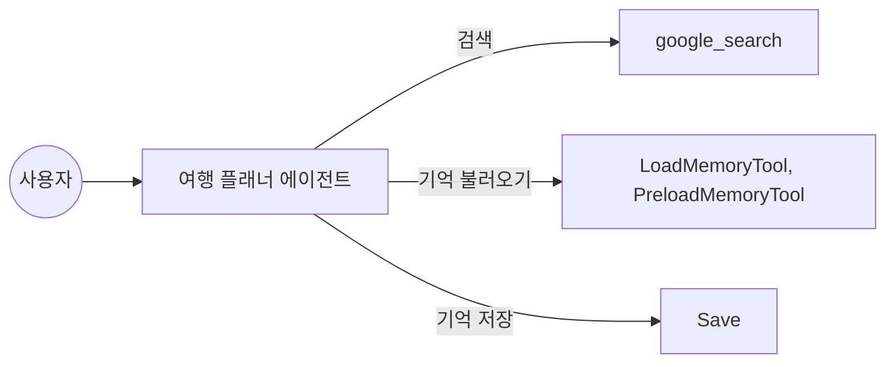
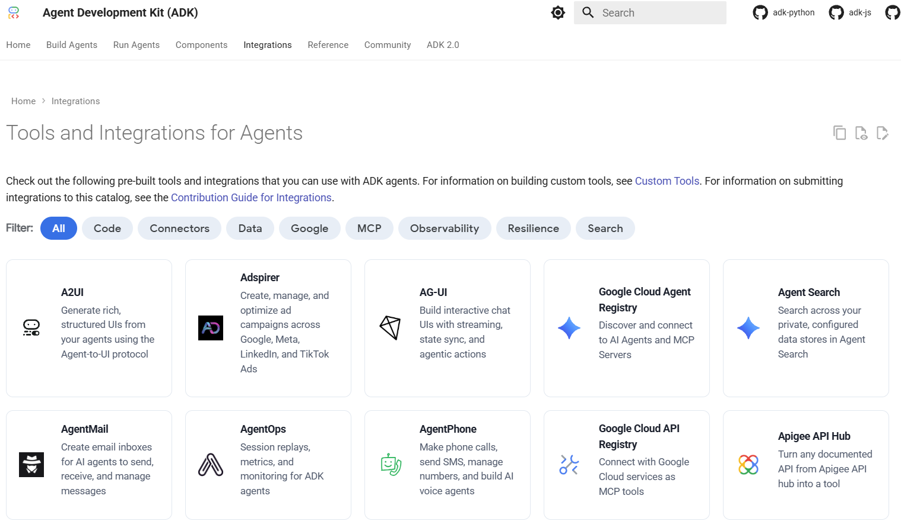
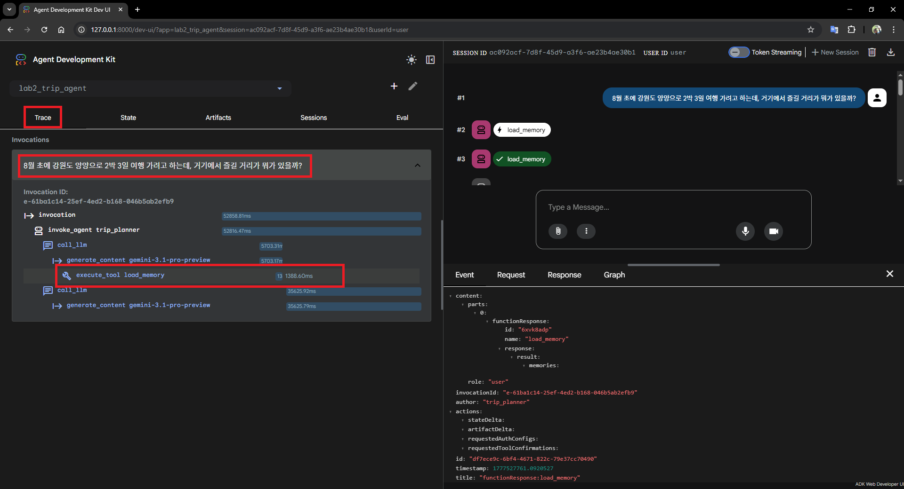

# Lab 2: 여행 검색과 메모리

Lab 2에서는 에이전트가 실시간 정보를 검색하고, 이전 대화 내용을 기억해 답변에 반영하는 방법을 배워 보겠습니다.

## 실습 목표

최신 여행 정보를 검색하는 `google_search` 도구와 대화 내용을 저장하고 불러오는 메모리 서비스의 활용법을 익힙니다.



이번 실습에서 만드는 에이전트는 최신 정보가 필요하면 검색을 하고, 이전 대화 내용이 필요하면 저장된 기억을 불러옵니다. 답변을 마친 뒤에는 현재 대화 내용을 자동으로 저장하는 기능을 콜백 함수를 이용해 구현해봅시다.

자 그러면 본격적으로 시작해볼까요?

## 1. 패키지 및 환경 설정

`lab2/handson` 폴더로 이동해서 가상환경을 준비합시다.

```bash
cd lab2/handson
python -m venv .venv
source .venv/bin/activate
python -m pip install --upgrade pip
python -m pip install -e .
```

가상환경 활성화 후 워크스페이스 루트의 `.env` 파일에 API 키가 설정되어 있는지 확인합니다. 설정이 완료된 `.env` 파일의 모습은 아래와 같습니다.

```env
GOOGLE_API_KEY=AIzaSy... (본인의 API 키 입력)
```

## 2. 현재 상태 점검

본격적으로 코드를 수정하기 전에, 도구와 콜백이 아직 연결되지 않은 초기 상태를 먼저 확인해 보겠습니다.

```bash
adk run agents/lab2_trip_agent \
  --session_service_uri="sqlite://./outputs/session.db" \
  --memory_service_uri="memory://"
```

이 명령어의 의미는 다음과 같습니다.

| 옵션 | 값 | 의미 |
| :--- | :--- | :--- |
| `--session_service_uri` | `sqlite://./outputs/session.db` | 세션 실행 기록을 SQLite 파일에 저장 |
| `--memory_service_uri` | `memory://` | 기억 저장소는 로컬 인메모리 방식으로 사용 |

세션 저장소를 `session.db`로 선택한다고 해서 장기 기억을 지원하는 것은 아닙니다. 실제 대화 기록은 메모리 서비스를 이용하니 이 점을 헷갈리지 않게 주의해주세요.
현재 예제에서는 `memory_service_uri="memory://"`를 사용합니다. 따라서 한번 진행한 대화를 이후 다시 ADK를 실행하여 확인할 경우 대화 기록이 사라지게 됩니다.

여기서 알 수 있듯이, ADK에서는 다루는 정보는 크게 두가지 방식으로 나뉩니다.

> **세션과 메모리**: 세션은 현재 대화의 이벤트와 상태를 관리하는 실행 기록을 의미합니다. 반면 메모리 서비스는 과거 대화에서 추출한 정보를 검색 가능한 장기 기억으로 저장하고, 이후 질문에서 다시 찾을 수 있게 해주는 별도 저장소 개념입니다.

이런 개념들을 바탕으로 ADK는 두가지 저장 옵션을 제공합니다. 물론 두가지를 동시에 사용할 수도 있습니다.

다시 개념을 정리해볼까요?
- **session_service_uri**: 현재 대화의 이벤트와 상태를 관리합니다. 예를 들어 `memory://`는 휘발성 세션이고, `sqlite://./outputs/session.db`는 세션 이벤트를 로컬 파일에 저장합니다.
- **memory_service_uri**: `PreloadMemoryTool`이나 `LoadMemoryTool`이 검색할 장기 기억 저장소를 연결합니다. 로컬 테스트에는 `memory://`를 사용할 수 있지만, 이 방식은 프로세스 종료 시 사라집니다. 재시작 후에도 유지되는 장기 기억은 `agentengine://<AGENT_ENGINE_ID>` 같은 장기 보관에 적합한 메모리 서비스가 필요합니다.

이번 예제에서 첫번째로는 `memory://`로 메모리 동작 방식을 확인합니다. 단, `memory://`는 프로세스가 종료되면 사라진다는 점을 유념하세요. 재시작 후에도 유지되는 장기 기억은 [추가적인 메모리 뱅크 서비스](https://adk.dev/sessions/memory/#choosing-the-right-memory-service)를 연결하여 사용합니다. 조금 구성이 어려울 수 있으므로 다음 내용을 차근차근 따라오세요! 다음 코드를 실행해봅시다.

```bash
adk run agents/lab2_trip_agent \
  --session_service_uri="sqlite://./outputs/session.db" \
  --memory_service_uri="memory://"
```

그 뒤에 다음과 같이 바닷가 인근 여행지를 알아볼까요?

```text
[user]: 이번 여행은 사람 적고 조용한 바닷가에서 쉬고 싶은데, 추천해 줄 만한 곳 있어?
```

잠시 뒤 다음과 같이 답변이 오면 `exit`를 눌러 대화를 종료하세요.

```text
[trip_planner]: 사람 북적이는 곳을 벗어나 조용히 파도 소리만 들으며 쉬고 싶으시군요! 강원도 고성의 가진해변을 추천해 드립니다.
[user]: exit
```

지금 위 대화 과정은 다음과 같은 절차대로 처리됩니다.

```text
사용자 대화
  ↓
Session Service
  - 현재 세션의 이벤트와 상태 저장
  - 여기서는 sqlite://./outputs/session.db 사용
  ↓
대화 저장

Memory Service
  - 세션 내용을 검색 가능한 기억으로 추가
  - 여기서는 memory:// 사용
  - 프로세스 종료 시 사라짐

다음 사용자 질문
  ↓
PreloadMemoryTool 또는 LoadMemoryTool (LoadMemory는 선택적으로 활용됩니다.)
  ↓
Memory Service에서 관련 기억 검색
  ↓
에이전트 답변에 반영
```

그러면 우리가 원하는 장기 기억은 어떻게 처리할까요? 다음 단계를 통해 천천히 알아봅시다.

## 3. 검색과 메모리 연결

이번 단계에서는 에이전트에 검색과 장기 메모리 기능을 추가할 것입니다. ADK는 에이전트 구현에 집중할 수 있도록 자주 쓰이는 도구들을 내장하고 있습니다. 이외에도 다양한 도구들을 [ADK Integrations](https://adk.dev/integrations/)에서 확인할 수 있습니다.



자, 먼저 `agents/lab2_trip_agent/agent.py`를 열어 에이전트 정의 부분을 확인해 봅시다.

```python
def build_trip_planner() -> LlmAgent:
    return LlmAgent(
        name="trip_planner",
        model="gemini-3.1-pro-preview",

        # TODO 1: 지침을 작성하세요.
        # 힌트: 웹 검색과 기억을 활용해 여행 계획을 세우는 플래너의 역할과 지침을 명시하세요.
        instruction=("당신은 ... 입니다. ... 하세요."),

        # TODO 2: 실시간 웹 검색과 매 턴 시작 시 기억을 불러올 도구를 리스트에 넣으세요.
        # 구글 검색, 메모리 불러오기 도구들을 사용해야 합니다.
        tools=[],

        generate_content_config=types.GenerateContentConfig(
            tool_config=types.ToolConfig(
                include_server_side_tool_invocations=True
            ),
        ),
    )
```

이번 Lab2에서는 위 코드의 TODO를 해결하면 됩니다. 몇가지 새로운 개념이 있죠? `generate_content_config` 속성이 눈에 띄는데 이곳에 `include_server_side_tool_invocations`이 활성화 되어있습니다. 이는 LLM이 외부 서버의 도구를 호출하고 그 결과를 받아와 에이전트에게 제공하는 역할을 합니다. 현재 예제에서는 `google_search`와 같은 도구들이 이러한 방식으로 동작하기 때문에 켜주시는게 좋습니다.

ADK의 메모리 서비스는 주로 다음과 같습니다.

| 항목 | `InMemoryMemoryService` | `VertexAiMemoryBankService` | `VertexAiRagMemoryService` |
| :--- | :--- | :--- | :--- |
| 지속성 | 없음. 재시작하면 데이터가 사라짐 | 있음. Agent Platform에서 관리 | 있음. Knowledge Engine에 저장 |
| 주요 사용 사례 | 프로토타이핑, 로컬 개발, 간단한 테스트 | 사용자 대화에서 의미 있는 기억을 만들고 지속적으로 발전시키는 에이전트 구축 | 전체 대화 코퍼스에 대한 벡터 검색 또는 다른 RAG 인덱싱 콘텐츠와 함께 검색 |
| 메모리 추출 방식 | 전체 대화 저장 | 대화에서 의미 있는 정보를 추출하고 기존 기억과 통합. LLM 기반 | 전체 대화를 저장하고 Knowledge Engine으로 인덱싱 |
| 검색 기능 | 기본 키워드 매칭 | 고급 의미 기반 검색 | Knowledge Engine 기반 벡터 유사도 검색 |
| 설정 복잡도 | 없음. 기본값 | 낮음. Agent Platform의 Agent Runtime 인스턴스 필요 | 중간. Knowledge Engine 필요 |
| 의존성 | 없음 | Google Cloud Project, Agent Platform API | Google Cloud Project, Knowledge Engine, Agent Platform SDK. 선택 설치 가능 |
| 사용하기 좋은 경우 | 여러 세션의 채팅 기록을 로컬에서 간단히 검색해보고 싶을 때 | 에이전트가 과거 상호작용을 기억하고 학습하듯 반영하게 만들고 싶을 때 | 이미 RAG 인프라가 있거나 원본 대화 기록 전체를 대상으로 검색하고 싶을 때 |

즉슨 `--memory_service_uri="memory://"` 옵션으로 실행하면 프로세스 안의 휘발성 메모리에 저장되고, 이후에 다룰 `--memory_service_uri="agentengine://..."` 등의 외부 메모리 서비스를 지정하면 외부 메모리 뱅크에 저장됩니다. [더 자세한 문서](https://adk.dev/sessions/memory/)를 살펴보세요.

```python
return LlmAgent(
    name="trip_planner",
    model="gemini-3.1-pro-preview",
    instruction=(
        "실시간 웹 검색과 이전 대화 기억을 활용해 "
        "사용자 맞춤 여행 계획을 세우는 플래너입니다.\n"
        "이전 대화 내용이나 사용자의 취향을 기억에서 불러와 답변에 반영하세요."
    ),
    tools=[
        google_search,

        # LoadMemoryTool은 에이전트가 메모리에서 정보를 검색할 때 사용할 수 있는 도구입니다.
        # 명시적인 호출이 없는 한 이 도구는 사용되지 않습니다.
        LoadMemoryTool(),

        # PreloadMemoryTool은 시작과 매번 대화 과정에 자동으로 실행하여 메모리에서 정보를 불러옵니다.
        PreloadMemoryTool(),
    ],
    generate_content_config=types.GenerateContentConfig(
        tool_config=types.ToolConfig(include_server_side_tool_invocations=True),
    ),
)
```

메모리 서비스를 연결하지 않거나 인메모리 상태로 에이전트를 실행하면, 에이전트는 이전 대화를 기억하지 못합니다. 다음과 같이 실행해볼까요?

```bash
adk run agents/lab2_trip_agent --memory_service_uri="memory://"
```

```text
[user]: 아까 말한 조용한 바다 근처로 숙소도 같이 추천해줄래?
[trip_planner]: 죄송하지만 현재 제가 이전 대화 내용이 초기화되어, 아까 말씀 나누셨던 조용한 바다가 정확히 어느 지역이었는지 기억하지 못하고 있습니다.
```

그러면 장기 기억을 활용하기 위해서는 어떻게 해야할까요? 바로 장기 기억을 위한 메모리 서비스를 연결해야 합니다. [에이전트 확장](https://docs.cloud.google.com/gemini-enterprise-agent-platform/scale?hl=ko) 개념을 이용하면 기존의 Agent에 여러 기능을 추가하여 확장할 수 있습니다.

### 에이전트 엔진 추가하기

이 과정을 위해서는 구글 클라우드 계정과 `gcloud cli`가 필요합니다.

```bash
gcloud auth application-default login
```

위 명령어를 통해 구글 클라우드 계정에 로그인 한 뒤, 여러분의 프로젝트와 리전이 올바르게 설정되었는지 확인해주세요. 프로젝트 ID는 [https://console.cloud.google.com/](https://console.cloud.google.com/) 페이지에 접속하면 바로 확인이 가능합니다.

```bash
export GOOGLE_CLOUD_PROJECT="your-gcp-project-id"
export GOOGLE_CLOUD_LOCATION="asia-northeast3"
```

> 참고: 메모리 뱅크는 지원되는 리전에서만 사용할 수 있습니다. 사용할 리전이 메모리 뱅크 지원 리전인지 먼저 확인하세요.

메모리 뱅크를 사용하기 위해서는 에이전트 런타임이 필요합니다. 에이전트 런타임을 생성하기 위해 에이전트 플랫폼 SDK을 설치해주세요. 에이전트 플랫폼이란 구글 클라우드에서 제공하는 에이전트 개발 전반에 필요한 여러 클라우드 자원을 통합적으로 관리할 수 있게 해주는 플랫폼입니다.

```bash
python -m pip install "google-cloud-aiplatform>=1.111.0"
```

이제 에이전트 런타임을 생성하기 위해 아래 코드를 실행해보세요.

```bash
python - <<'PY'
import os
import vertexai

project = os.environ["GOOGLE_CLOUD_PROJECT"]
location = os.environ["GOOGLE_CLOUD_LOCATION"]

client = vertexai.Client(
    project=project,
    location=location,
)

agent_engine = client.agent_engines.create()

print("Agent Engine resource name:")
print(agent_engine.api_resource.name)

print("\nUse this with ADK:")
print(f"agentengine://{agent_engine.api_resource.name}")
PY
```

출력은 대략 다음과 같은 형식입니다.

```text
Agent Engine resource name:
projects/your-gcp-project-id/locations/asia-northeast3/reasoningEngines/1234567890123456789

Use this with ADK:
agentengine://projects/your-gcp-project-id/locations/asia-northeast3/reasoningEngines/1234567890123456789
```

이제 출력된 값을 `--memory_service_uri`에 넣어 실행합니다.

```bash
adk run agents/lab2_trip_agent \
  --session_service_uri="sqlite://./outputs/session.db" \
  --memory_service_uri="agentengine://1234567890123456789" \
  --session_id="my_trip"
```

첫 번째 실행에서 가고싶은 곳을 말해보세요.

```text
[user]: 8월 초에 강원도 양양으로 2박 3일 여행 가려고 하는데, 거기에서 즐길 거리가 뭐가 있을까?
[trip_planner]: 수석 플래너입니다! 이전에 말씀해 주셨던 **'8월 초 양양 2박 3일 여행'** 일정을 잘 기억하고 있습니다.

8월 초의 양양은 여름휴가의 절정을 맞이하여 활기찬 분위기와 청정한 자연 을 동시에 누릴 수 있는 최고의 여행지입니다. 일정에 맞춰 다채롭게 즐기실 수 있는 양양의 대표적인 즐길 거리들을 테마별로 정리해 드립니다. (... 후략)
[user]: exit
```

대화를 `exit`를 입력해 종료했다면, 같은 세션 ID로 대화를 다시 이어서 해보겠습니다.

```bash
adk run agents/lab2_trip_agent \
  --session_service_uri="sqlite://./outputs/session.db" \
  --memory_service_uri="agentengine://1234567890123456789" \
  --session_id="my_trip"
```

이제 앞서 나눴던 대화 내용에 대해서 얘기를 해볼까요?

```text
[user]: 내가 아까 말했던 여행지에 어울리는 숙소도 추천해줄래?
[trip_planner]: 이전에 말씀해주신 **8월 초 강원도 양양 2박 3일 여행**에 딱 맞는 숙소들을 추천해 드릴게요!

8월의 양양은 서핑과 해수욕, 그리고 특유의 힙한 분위기를 즐기기 가장 좋 은 성수기입니다. 여행 스타일과 취향에 맞춰 선택하실 수 있도록 네 가지  테마로 나누어 엄선해 보았습니다. (... 후략)
[user]: exit
```

정상적으로 동작하면 `PreloadMemoryTool` 또는 `LoadMemoryTool`이 메모리 뱅크에서 관련 기억을 검색해, 사용자가 조용한 동해 바다나 강원도 고성을 선호했다는 맥락을 답변에 반영하는 것을 볼 수 있습니다.

> 주의 사항: 현재 버전에서는 `--memory_service_uri="sqlite://./outputs/memory.db"`와 같이 SQLite 파일은 `memory_service_uri`에서 지원하지 않습니다. SQLite 파일은 `session_service_uri`의 세션 저장소로는 사용할 수 있지만, `memory_service_uri`에서 사용하면 에러가 발생합니다.

### ADK 웹 콘솔에서 확인하기

웹 콘솔에서도 같은 방식으로 사용할 수 있습니다.

```bash
adk web agents/ \
  --session_service_uri="sqlite://./outputs/session.db" \
  --memory_service_uri="agentengine://1234567890123456789" \
  --session_id="my_trip"
```

정상적으로 웹이 시작되었다면 브라우저에서 `http://127.0.0.1:8000`에 접속한 뒤 `trip_planner`를 선택하고 `"내가 아까 말했던 여행지에 어울리는 숙소도 추천해줄래?"`라고 물어신 후에 Trace 탭을 클릭해 보세요.

`PreloadMemoryTool` 또는 `LoadMemoryTool`이 메모리 서비스에서 관련 기억을 가져오는지 확인할 수 있습니다.



두 번째 실습을 마쳤습니다. 다음 실습에서는 여러 에이전트를 연결하는 방법을 배워보겠습니다.

👉 [Lab 3. 모임 관리 에이전트](../lab3/README.md)