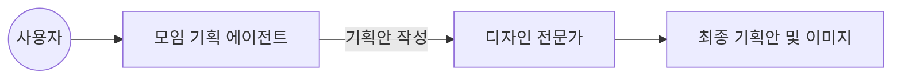
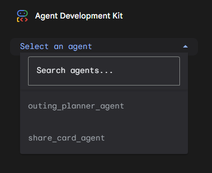

# Lab 3: 모임 관리 에이전트 협업

이번 실습에서는 여러 에이전트를 연결하여 모임 기획부터 이미지 생성까지 수행하는 협업 구조를 구현합니다.

---

## 1. 실습 개요
이번 실습은 여러 에이전트를 순차적으로 실행하는 **SequentialAgent** 구조를 활용합니다. 기획과 디자인 에이전트가 정보를 주고받으며 하나의 결과물을 도출하는 과정을 실습합니다.



## 2. 패키지 및 환경 설정

실습 폴더인 `lab3/handson`으로 이동해서 독립적인 가상환경을 준비합니다.

```bash
cd lab3/handson
python -m venv .venv
source .venv/bin/activate
python -m pip install --upgrade pip
python -m pip install -e .
```

가상환경 활성화 후에는 워크스페이스 루트의 `.env` 파일에 API 키가 설정되어 있는지 확인합니다.

## 3. 초기 상태 확인

수정 전 에이전트의 동작을 확인합니다.

```bash
adk run agents/lab3_meeting_agent
```

초기 상태의 에이전트는 협업 구조가 비어 있어 사용자 요청에 응답하지 않습니다.

## 4. 에이전트 협업 구현

`agents/lab3_meeting_agent/agent.py` 파일의 TODO 항목을 채워 협업 구조를 완성합니다.

### 4-1. 기획 에이전트 설정 (TODO 1, 2)

`meeting_planner`에게 역할을 정의하고 검색/메모리 도구를 함께 사용하도록 설정합니다.

```python
meeting_planner = LlmAgent(
    name="meeting_planner",
    model="gemini-3.1-flash-lite-preview",
    # TODO 1: 모임 기획 매니저의 역할을 작성하세요.
    instruction=(
        "모임 기획 매니저입니다. "
        "웹 검색과 기억 데이터를 활용해 모임 주제, 시간, 장소를 정리하세요."
    ),
    tools=[google_search, *memory_retrieval_tools],
    # TODO 2: 검색 도구와 메모리 도구 동시 사용 설정을 추가하세요.
    generate_content_config=types.GenerateContentConfig(
        tool_config=types.ToolConfig(
            include_server_side_tool_invocations=True,
        ),
    ),
    after_agent_callback=auto_save_session_to_memory_callback,
)
```

### 4-2. 협업 흐름 연결 (TODO 3)

`meeting_planner`와 `design_expert`를 순서대로 배치합니다. `SequentialAgent`는 등록된 에이전트를 순서대로 실행하며 대화 맥락(Context)을 전달합니다.

```python
def build_meeting_manager() -> SequentialAgent:
    return SequentialAgent(
        name="root_agent",
        # TODO 3: 에이전트들을 순서대로 배치하세요.
        sub_agents=[
            meeting_planner,
            design_expert,
        ],
    )
```

## 5. 결과 확인

구현한 협업 기능이 정상적으로 동작하는지 확인합니다.

```bash
adk run agents/lab3_meeting_agent
```

프롬프트에 "제주도 워크숍 기획해줘"라고 입력합니다. 기획안 작성 후 디자인 전문가가 테마 이미지를 생성하는 흐름이 이어지면 성공입니다.

### ADK 웹 콘솔 활용 가이드

웹 콘솔을 이용하면 여러 에이전트 간의 대화 흐름과 생성된 아티팩트(이미지 등)를 직관적으로 확인할 수 있습니다.

#### Step 1: 웹 콘솔 서버 실행
```bash
adk web agents/
```

#### Step 2: 브라우저 접속 및 에이전트 선택
1. `http://127.0.0.1:8000`에 접속합니다.
2. 좌측 메뉴에서 `root_agent`를 선택합니다.

#### Step 3: 협업 및 아티팩트 확인
대화 결과로 출력된 기획안과 함께, 우측 **Artifacts** 탭 또는 메시지 하단에서 생성된 테마 이미지를 확인할 수 있습니다.




---

모든 실습을 마쳤습니다. 에이전트 협업을 통해 더 복잡한 문제를 해결하는 방법을 익히시느라 고생 많으셨습니다!
