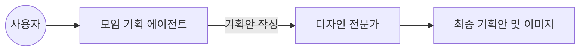
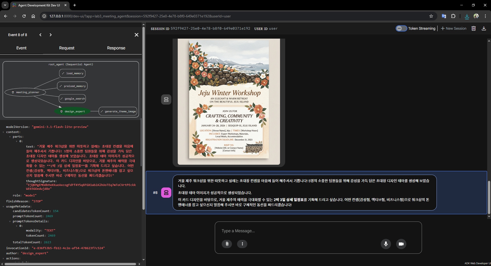
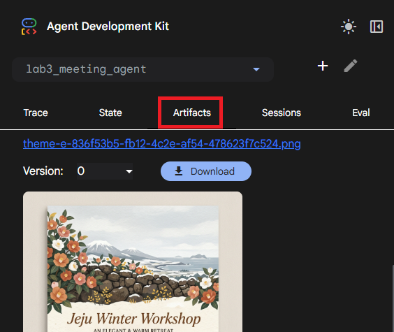

# Lab 3: 모임 관리 에이전트 협업

> [!NOTE]
> 실습 진행에 필요한 발표 자료와 가이드를 확인해 주세요.
> - 발표 자료: [Google Slides](https://docs.google.com/presentation/d/1LSxyGVS2fpUWVQ_QHji3HeSw9zw5Ms2Lwcr9jQNfS3U/edit?usp=sharing)
> - 핸즈온 대처 가이드: [Google Docs](https://docs.google.com/document/d/1x8hEyDTr-tvmfCzUtUYkC7z_KOJFxbxD/edit?usp=sharing&ouid=114268949095976081208&rtpof=true&sd=true) (진행 중 오류가 발생할 경우 참고하세요.)

이번 실습에서는 여러 에이전트를 연결하여 모임 기획부터 이미지 생성까지 수행하는 협업 구조를 구현합니다.

---

## 1. 실습 개요

이번 실습은 여러 에이전트를 순차적으로 실행하는 **SequentialAgent** 구조를 활용합니다. 기획과 디자인 에이전트가 정보를 주고받으며 하나의 결과물을 도출하는 과정을 실습합니다.



## 2. 패키지 및 환경 설정

실습 폴더인 `lab3/handson`으로 이동해서 `uv`로 독립적인 가상환경을 준비합니다. `uv`가 아직 없다면 [uv 설치 문서](https://docs.astral.sh/uv/getting-started/installation/)를 참고하세요. macOS, Linux, WSL 환경에서는 아래 명령어로 설치하고, 설치 경로인 `~/.local/bin`을 PATH에 등록합니다.

```bash
curl -LsSf https://astral.sh/uv/install.sh | sh
export PATH="$HOME/.local/bin:$PATH"
echo 'export PATH="$HOME/.local/bin:$PATH"' >> ~/.zshrc
uv --version
```

```bash
cd lab3/handson
uv sync
source .venv/bin/activate

# uv를 사용할 수 없는 경우에만 아래 pip 방식으로 설치합니다.
# python -m venv .venv
# source .venv/bin/activate
# python -m pip install --upgrade pip
# python -m pip install -e .
```

설치 후에는 워크스페이스 루트의 `.env` 파일에 API 키가 설정되어 있는지 확인합니다.

## 3. 초기 상태 확인

수정 전 에이전트의 동작을 확인합니다.

```bash
adk run agents/lab3_meeting_agent

(...중략...)
pydantic_core._pydantic_core.ValidationError: 2 validation errors for LlmAgent
instruction.str
  Input should be a valid string [type=string_type, input_value=Ellipsis, input_type=ellipsis]
    For further information visit https://errors.pydantic.dev/2.12/v/string_type
instruction.callable
  Input should be callable [type=callable_type, input_value=Ellipsis, input_type=ellipsis]
    For further information visit https://errors.pydantic.dev/2.12/v/callable_type
```

에러가 나는 상태가 정상입니다. 핸즈온 코드의 초기 상태는 협업 구조가 비어 있어 실패하게 됩니다.

## 4. 에이전트 협업 구현

자 그러면 `agents/lab3_meeting_agent/agent.py` 파일의 TODO 항목을 채워가며 에이전트의 협업 구조를 이해해보는 시간을 가져봅시다.

### 4-1. 기획 에이전트 설정

`meeting_planner`에게 역할을 정의하고 검색/메모리 도구를 함께 사용하도록 설정합니다.

```python
meeting_planner = LlmAgent(
    name="meeting_planner",
    model="gemini-3.1-flash-lite-preview",
    instruction=(
        "당신은 모임을 기획하는 매니저입니다. "
        "웹 검색과 기억을 활용해 모임의 주제, 시간, 장소를 정리하세요."
    ),
    tools=[google_search, *memory_retrieval_tools],
    generate_content_config=types.GenerateContentConfig(
        tool_config=types.ToolConfig(
            include_server_side_tool_invocations=True,
        ),
    ),
)
```

`design_expert`도 마찬가지로 역할을 정의하고 이미지 생성 도구를 함께 사용하도록 설정합니다.

```python
design_expert = LlmAgent(
    name="design_expert",
    model="gemini-3.1-flash-lite-preview",
    instruction=(
        "1. 반드시 generate_theme_image 도구를 호출하여 "
        "기획안에 어울리는 테마 이미지를 생성하세요. "
        "2. 이미지 생성이 완료된 후에는 이미지가 생성되었다는 내용을 "
        "친절하게 안내하세요. "
        "3. 주의: 텍스트 응답에 이미지 링크나 마크다운 태그()를 포함하면 안 됩니다."
    ),
    tools=[generate_theme_image],
    generate_content_config=types.GenerateContentConfig(
        tool_config=types.ToolConfig(
            include_server_side_tool_invocations=True,
        ),
    ),
)
```

### 4-2. 에이전트 협업 구성

모든 에이전트를 정의했다면, 이제 협업 구조를 만들어 보겠습니다.
`agents/lab3_meeting_agent/agent.py` 파일 그대로 조금 아래로 내리면 `build_meeting_manager()` 함수를 찾을 수 있습니다. 이 함수에 `meeting_planner`와 `design_expert`를 순서대로 구성해보겠습니다. `SequentialAgent`를 이용해 에이전트 여럿을 연결하여 아래와 같이 순서대로 실행된 에이전트의 결과물을 다음 에이전트의 입력으로 전달할 수 있습니다.

```python
def build_meeting_manager() -> SequentialAgent:
    return SequentialAgent(
        name="root_agent",
        sub_agents=[
            meeting_planner,
            design_expert,
        ],
    )
```

**ADK 멀티 에이전트 주요 객체**

ADK에는 여러 에이전트를 협업 구조로 구성하기 위한 다양한 객체가 있습니다. 다음 표를 살펴봅시다.

| ADK 주요 객체         | 역할                                                                                     | 구현 가능한 패턴                           | 활용 예시                                                    |
| :-------------------- | :--------------------------------------------------------------------------------------- | :----------------------------------------- | :----------------------------------------------------------- |
| **`SequentialAgent`** | 에이전트를 정해진 순서대로 실행하며 파이프라인 구축 (`output_key`, `session.state` 활용) | Sequential Pipeline                        | 문서 파싱 후 데이터 추출, 기획안 작성 후 디자인 생성         |
| **`LlmAgent`**        | 기본 에이전트 역할 및 하위 에이전트로의 작업 라우팅 (`sub_agents`, `description` 기반)   | Coordinator / Dispatcher                   | 사용자 의도를 파악해 적합한 전문 담당 에이전트로 연결        |
| **`ParallelAgent`**   | 여러 작업을 병렬로 동시에 실행하고 마지막에 결과를 취합 (고유 `output_key` 지정)         | Parallel Fan-Out / Gather                  | 코드 리뷰 시 보안, 스타일, 성능 검사를 동시에 진행 후 종합   |
| **`LoopAgent`**       | 특정 조건이 충족될 때까지 작업을 반복 실행 (`max_iterations`, `EventActions` 제어)       | Generator and Critic, Iterative Refinement | 초안 작성 후 검토 에이전트의 피드백을 받아 반복 수정         |
| **`AgentTool`**       | 특정 에이전트 자체를 다른 에이전트가 호출할 수 있는 도구(Tool)로 래핑하여 위임           | Hierarchical Decomposition                 | 메인 리포트 에이전트가 필요할 때 전문 리서치 에이전트를 호출 |

이번 Lab 3에서는 이 중에서 **`SequentialAgent`**를 활용 하겠습니다. `meeting_planner`가 모임 기획안을 먼저 작성하고, 그 결과물을 `design_expert`가 넘겨받아 테마 이미지를 생성하는 깔끔한 파이프라인을 만들어 봅시다.

### 4-3. 이미지 생성 도구 구현

이미지 생성은 [Nano Banana2](https://gemini.google/kr/overview/image-generation/?hl=ko-KR) API를 이용해 구현할 수 있습니다. `agents/lab3_meeting_agent/tools.py` 파일을 다음과 같이 변경해서 API 기능을 연결해봅시다.

```python
async def generate_theme_image(
    prompt: str,
    tool_context=None,
) -> dict[str, Any]:
    from google import genai
    from google.genai import types as genai_types

    api_key = os.environ.get("GOOGLE_API_KEY") or os.environ.get("GEMINI_API_KEY")
    client = genai.Client(api_key=api_key)

    response = client.models.generate_content(
        model="gemini-3.1-flash-image-preview",
        contents=[prompt],
        config=genai_types.GenerateContentConfig(
            response_modalities=[genai_types.Modality.IMAGE],
        ),
    )

    image_bytes = None
    for part in response.candidates[0].content.parts:
        if part.inline_data:
            image_bytes = part.inline_data.data
            break

    if not image_bytes:
        return {"ok": False, "error": "이미지 생성 실패"}

    invocation_id = getattr(
        tool_context,
        "invocation_id",
        "default",
    )
    filename = f"theme-{invocation_id}.png"

    if hasattr(tool_context, "save_artifact"):
        await tool_context.save_artifact(
            filename,
            genai_types.Part.from_bytes(
                data=image_bytes,
                mime_type="image/png",
            ),
        )

    return {
        "ok": True,
        "filename": filename,
        "description": f"이미지가 {filename}으로 저장되었습니다.",
    }
```

## 5. 결과 확인

구현한 에이전트 협업 기능이 모두 정상적으로 동작하는지 해볼까요? 다음 코드를 실행해보세요.

```bash
adk run agents/lab3_meeting_agent
```

프롬프트에 `"제주도 워크샵을 올 해 겨울에 5명이 갈 예정인데 워크샵 초대에 어울리는 카드좀 기획해볼래?"`라고 입력합니다. 기획안 작성 후 디자인 전문가가 테마 이미지를 생성하는 결과가 모두 잘 보인다면 짝짝짝! 마지막 Lab3의 에이전트도 성공적으로 구현하셨습니다. 다음과 같은 결과가 출력될 것입니다.

```text
[user]: 제주도 워크샵을 올 해 겨울에 5명이 갈 예정인데 워크샵 초대에 어울리는 카드좀 기획해볼래?
[meeting_planner]: 제주도 겨울 워크샵이라니 정말 설레는 계획이네요! 5명의 소규모 인원이니, 너무 딱딱하지 않으면서도 따뜻하고 끈끈한 팀워크를  다질 수 있는 컨셉의 초대장이 좋을 것 같습니다.

모임 기획 매니저로서, 겨울 제주도의 감성을 담은 **워크샵 초대 카드 기획안 3가지**를 제안합니다.

---

### 컨셉 1: [쉼과 재충전] "제주, 겨울의 온기"
(...중략...)

---

### 💡 기획 매니저의 Tip!

1.  **전달 방식:** 카톡 단톡방에 올리실 예정이라면 **'이미지 카드'** 형태로 제작해 보세요. (Canva 같은 무료 툴을 사용하면 전문가처럼 쉽게 만들 수 있습니다.)
2.  **티저(Teaser) 활용:** 워크샵 1~2주 전에 "커밍순(Coming Soon)" 이미지로 기대감을 높이고, 위 초대장을 보내는 방식을 추천합니다.
(...중략...)

워크샵 초대 카드에 어울리는 따뜻하고 감성적인 분위기의 이미지가 성공적 으로 생성되었습니다.

이 이미지를 활용해 전달해 드린 문구 예시를 카드에 입히면, 팀원들에게 매우 특별하고 정성 어린 초대장이 될 것 같습니다. 기획안 중에서 팀의 현재 분위기에 가장 잘 맞는 컨셉을 선택해 보세요. 추가로 세부 일정표나 구체적인 활동 아이디어가 필요하시면 언제든 말씀해 주세요!
[user]: exit
```

### ADK 웹 콘솔 활용 가이드

웹 콘솔을 이용하면 여러 에이전트 간의 대화 흐름과 생성된 아티팩트를 직관적으로 확인할 수 있습니다.

#### Step 1: 웹 콘솔 서버 실행

```bash
adk web agents/ --host 0.0.0.0 --allow_origins="*"
```

#### Step 2: 브라우저 접속 및 에이전트 선택

1. `http://127.0.0.1:8000`에 접속합니다.
2. 좌측 메뉴에서 `lab3_meeting_agent`를 선택합니다.
3. 메시지를 입력하는 창에 `"제주도 워크샵을 올 해 겨울에 5명이 갈 예정인데 워크샵 초대에 어울리는 카드좀 기획해볼래?"`라고 입력합니다.

#### Step 3: 협업 및 아티팩트 확인

모든 구성이 정상적이라면, 이미지 출력을 확인할 수 있습니다. 다음 결과와 같은지 확인해보세요.



또한, 좌측의 **Artifacts** 탭 또는 메시지 하단에서 생성된 테마 이미지를 확인할 수 있습니다.



---

모든 실습을 마쳤습니다. 에이전트 협업을 통해 더 복잡한 문제를 해결하는 방법을 익히시느라 고생 많으셨습니다!
